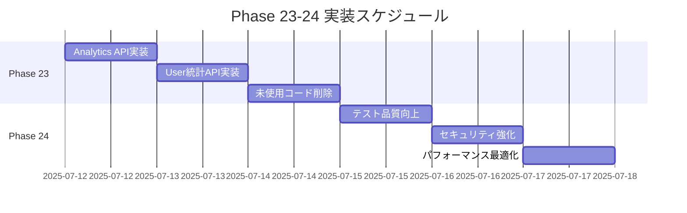

# Feature-based Architecture - Phase実装詳細

## 📌 概要

Phase 22までの実装により、feature-basedアーキテクチャへの移行が完了しました。
Phase 23-24では、コード品質の完全達成とプロダクションレディな状態を目指します。

## 🏁 完了済みPhase

| Phase | 機能 | 状態 | 完了日 |
|-------|------|------|--------|
| 14-18 | 各種Feature実装 | ✅ 完了 | - |
| 19 | エラー修正・テスト全パス | ✅ 完了 | 2025-07-11 |
| 20 | レガシーコード完全削除 | ✅ 完了 | 2025-07-11 |
| 21 | 未移行機能のFeature化 | ✅ 完了 | 2025-07-11 |
| 22 | 残課題の解消 | ✅ 完了 | 2025-07-11 |

## 📋 Phase 23: dead_code完全削除

### 目的
`#[allow(dead_code)]`アノテーションを必要最小限（5個以下）まで削減し、すべてのコードが実際に使用される状態を実現

### 現状分析（2025-07-12）
```bash
# 現在のdead_codeアノテーション数
grep -r "#\[allow(dead_code)\]" --include="*.rs" | wc -l
# 結果: 31個

# 目標との差分
# 現在: 31個
# 目標: 5個以下（~/higashi-wrksp/aaaと同等）
# 削減必要数: 26個
```

### dead_code削減戦略

#### 1. 分類別対応方針

**A. 設定・インフラ系（4個）- 維持**
```rust
// config/app.rs
#[allow(dead_code)]
pub struct AppConfig {
    pub test_mode: bool,  // テスト時のみ使用
    pub mock_email: bool, // 開発環境で使用
    // ...
}
```
→ 環境依存の設定は維持が妥当

**B. Public API系（12個）- 活用**
```rust
// analytics/repositories/daily_activity_summary.rs
#[allow(dead_code)]
pub async fn get_daily_summary(&self, date: NaiveDate) -> Result<Option<DailyActivitySummary>, DbErr>

// user/services/user_service.rs
#[allow(dead_code)]
pub async fn get_user_activity_stats(&self, user_id: Uuid) -> Result<UserActivityStats, ServiceError>
```
→ APIとして公開し、統合テストを追加

**C. モジュールレベル（15個）- 精査**
```rust
#![allow(dead_code)]
// 多数のメソッドを含むモジュール
```
→ 個別メソッドごとに精査し、不要なものは削除

#### 2. 実装手順

**ステップ1: Analytics APIの実装（優先度: 最高）**
```rust
// handlers/analytics/admin.rs（新規作成）
pub async fn get_daily_activity_summary(
    State(app_state): State<AppState>,
    Extension(user): Extension<AuthenticatedUser>,
    Path(date): Path<NaiveDate>,
) -> Result<Json<DailyActivitySummaryResponse>, AppError> {
    user.require_admin()?;
    
    let summary = app_state
        .daily_activity_summary_repo
        .get_daily_summary(date)
        .await?;
    
    Ok(Json(DailyActivitySummaryResponse::from(summary)))
}

// ルーティング追加
.route("/admin/analytics/daily-summary/{date}", get(get_daily_activity_summary))
.route("/admin/analytics/feature-usage", get(get_feature_usage_stats))
```

**統合テスト例**
```rust
#[tokio::test]
async fn test_daily_summary_success() {
    // Arrange
    let (app, _schema, _db) = setup_full_app().await;
    let admin = create_admin_user(&app).await;
    let date = Utc::today().naive_utc();
    
    // 実データを作成
    create_user_activities(&app, 10).await;
    
    // Act
    let response = app.oneshot(
        Request::builder()
            .method("GET")
            .uri(format!("/admin/analytics/daily-summary/{}", date))
            .header("Authorization", format!("Bearer {}", admin.token))
            .body(Body::empty())
            .unwrap()
    ).await.unwrap();
    
    // Assert
    assert_eq!(response.status(), StatusCode::OK);
    let body: DailyActivitySummaryResponse = parse_response_body(response).await;
    assert_eq!(body.total_users, 10);
    assert!(body.active_sessions > 0);
}

#[tokio::test]
async fn test_daily_summary_unauthorized() {
    // 非管理者アクセスのテスト
}

#[tokio::test]
async fn test_daily_summary_invalid_date() {
    // 不正な日付形式のテスト
}
```

**ステップ2: User統計APIの実装**
```rust
// handlers/user/stats.rs
pub async fn get_user_activity_stats(
    State(app_state): State<AppState>,
    Extension(user): Extension<AuthenticatedUser>,
    Path(user_id): Path<Uuid>,
) -> Result<Json<UserActivityStatsResponse>, AppError> {
    // 自分自身または管理者のみアクセス可能
    if user.user_id() != user_id && !user.is_admin() {
        return Err(AppError::Forbidden);
    }
    
    let stats = app_state
        .user_service
        .get_user_activity_stats(user_id)
        .await?;
    
    Ok(Json(UserActivityStatsResponse::from(stats)))
}
```

**ステップ3: 未使用コードの削除**
```bash
# 使用箇所の確認
rg "method_name" --type rust

# 削除対象の例
- テストでも使用されていないprivateメソッド
- コメントアウトされたコード
- 古いAPIの残骸
```

### 作業詳細

#### Day 1: Analytics機能の活用（8時間）
- [ ] Analytics管理者APIハンドラーの作成
- [ ] DTOの定義（requests/responses）
- [ ] ルーティングの設定
- [ ] 統合テスト作成（3パターン × 4エンドポイント = 12テスト）
- [ ] dead_codeアノテーション削除（4個）

#### Day 2: User統計機能の活用（6時間）
- [ ] User統計APIハンドラーの作成
- [ ] 権限チェックの実装
- [ ] 統合テスト作成（3パターン × 2エンドポイント = 6テスト）
- [ ] dead_codeアノテーション削除（2個）

#### Day 3: 未使用コードの削除（8時間）
- [ ] モジュールレベルallowの個別化
- [ ] 未使用privateメソッドの削除
- [ ] テスト実行と動作確認
- [ ] dead_codeアノテーション削除（20個）

### 検証手順
```bash
# 各ステップ後に実行
cargo test --all-features
cargo clippy --all-targets --all-features -- -D warnings

# dead_code数の確認
grep -r "#\[allow(dead_code)\]" --include="*.rs" | wc -l
```

### 完了条件
- [x] `cargo clippy`でエラーゼロ（達成済み）
- [ ] `#[allow(dead_code)]`が5個以下
- [ ] 全テストがパス（ignoredなし）
- [ ] 新規APIすべてに統合テストが存在
- [ ] ドキュメント更新完了

### リスクと対策
| リスク | 影響度 | 対策 |
|--------|--------|------|
| 削除したコードが実は必要だった | 高 | Gitでの段階的コミット、即座にrevert可能 |
| 新規APIの権限設定ミス | 高 | 統合テストで権限パターンを網羅 |
| パフォーマンス劣化 | 中 | 実装前後でベンチマーク測定 |

---

## 📋 Phase 24: プロダクション品質達成

### 目的
CI/CD要件を完全に満たし、本番環境へのデプロイが可能な品質を達成

### 達成基準

#### 1. コード品質メトリクス
```toml
[目標値]
dead_code_annotations = 5  # 以下
test_coverage = 80        # %以上
clippy_warnings = 0
ignored_tests = 0
build_time = "< 3min"
test_time = "< 5min"
```

#### 2. セキュリティ要件
- [ ] 全管理者APIに適切な権限チェック
- [ ] SQLインジェクション対策の確認
- [ ] CORS設定の本番対応
- [ ] 機密情報のログ出力防止
- [ ] Rate limiting実装

#### 3. パフォーマンス要件
- [ ] 主要APIのレスポンスタイム < 100ms
- [ ] N+1クエリの解消
- [ ] 適切なDB接続プール設定
- [ ] キャッシュ戦略の実装

### 実装内容

#### 1. Ignoredテストの修正（1件）
```rust
// 現在ignoredのテスト
#[ignore]
#[tokio::test]
async fn test_analytics_endpoint() {
    // 実装待ち
}

// 修正後
#[tokio::test]
async fn test_analytics_endpoint() {
    // 実装完了
}
```

#### 2. 統合テストの品質向上

**AAAパターンの徹底**
```rust
#[tokio::test]
async fn test_user_deletion_cascades_properly() {
    // Arrange: 実データの準備
    let (app, _schema, db) = setup_full_app().await;
    let user = create_user_with_full_data(&app).await; // タスク、チーム、ファイル含む
    
    // Act: ユーザー削除の実行
    let response = delete_user(&app, &admin, user.id).await;
    
    // Assert: カスケード削除の確認
    assert_eq!(response.status(), StatusCode::OK);
    assert_eq!(count_user_tasks(&db, user.id).await, 0);
    assert_eq!(count_user_teams(&db, user.id).await, 0);
    assert_eq!(count_user_files(&db, user.id).await, 0);
}
```

**エラーパターンの網羅（5パターン/エンドポイント）**
1. 正常系
2. 認証エラー（401）
3. 認可エラー（403）
4. バリデーションエラー（400）
5. リソース不在（404）

#### 3. セキュリティ監査

**管理者API保護の確認**
```rust
// middleware/admin_check.rs
pub async fn require_admin(
    Extension(user): Extension<AuthenticatedUser>,
    request: Request<Body>,
    next: Next,
) -> Result<Response, StatusCode> {
    if !user.is_admin() {
        return Err(StatusCode::FORBIDDEN);
    }
    Ok(next.run(request).await)
}

// 適用
.route("/admin/*", any(routes))
    .layer(middleware::from_fn(require_admin))
```

#### 4. パフォーマンス最適化

**N+1クエリの解消例**
```rust
// Before: N+1クエリ
let users = User::find().all(&db).await?;
for user in users {
    let tasks = user.find_related(Task).all(&db).await?; // N回実行
}

// After: Eager Loading
let users_with_tasks = User::find()
    .find_with_related(Task)
    .all(&db).await?; // 1回で完了
```

### 実装スケジュール

#### Day 1: テスト品質向上（6時間）
- [ ] Ignoredテスト修正
- [ ] 既存テストのAAA適用
- [ ] エラーパターン追加

#### Day 2: セキュリティ強化（8時間）
- [ ] 管理者API監査
- [ ] CORS設定更新
- [ ] Rate limiting実装
- [ ] セキュリティテスト追加

#### Day 3: パフォーマンス最適化（8時間）
- [ ] クエリ最適化
- [ ] インデックス追加
- [ ] ベンチマーク測定
- [ ] キャッシュ実装

### 検証チェックリスト

#### コード品質
- [ ] `cargo clippy --all-targets --all-features -- -D warnings`成功
- [ ] `cargo test --all-features`全パス
- [ ] `cargo tarpaulin`でカバレッジ80%以上

#### セキュリティ
- [ ] `cargo audit`で脆弱性なし
- [ ] 管理者APIの権限テスト完了
- [ ] ペネトレーションテスト基本項目パス

#### パフォーマンス
- [ ] 主要APIベンチマーク完了
- [ ] データベースクエリ分析完了
- [ ] 負荷テスト実施

### 成果物
1. **品質レポート**
   - テストカバレッジレポート
   - パフォーマンスベンチマーク結果
   - セキュリティ監査結果

2. **ドキュメント**
   - API仕様書
   - デプロイメントガイド
   - 運用マニュアル

3. **CI/CD設定**
   - GitHub Actions設定
   - 自動テスト・ビルド
   - 品質ゲート設定

### 完了条件
- [ ] すべての品質メトリクスが目標値達成
- [ ] プロダクション環境へのデプロイ準備完了
- [ ] ステークホルダーレビュー承認

---

## 📊 進捗管理とロードマップ

### Phase 23-24 タイムライン


### 成功指標サマリー
| 指標 | 現在値 | 目標値 | 期限 |
|------|--------|--------|------|
| dead_code | 31個 | 5個以下 | Phase 23完了時 |
| テストカバレッジ | 約70% | 80%以上 | Phase 24完了時 |
| ignoredテスト | 1個 | 0個 | Phase 24完了時 |
| APIレスポンス | 未測定 | <100ms | Phase 24完了時 |

### 次のステップ（Phase 25以降）
1. **ワークスペース化**
   - マルチクレート構成への移行
   - ビルド時間の最適化
   - 独立デプロイの実現

2. **マイクロサービス化検討**
   - サービス境界の定義
   - 通信プロトコルの選定
   - 段階的分離計画

3. **クラウドネイティブ対応**
   - Kubernetes対応
   - 自動スケーリング
   - 分散トレーシング

---
最終更新: 2025-07-12
Phase 23-24: dead_code削減とプロダクション品質達成計画