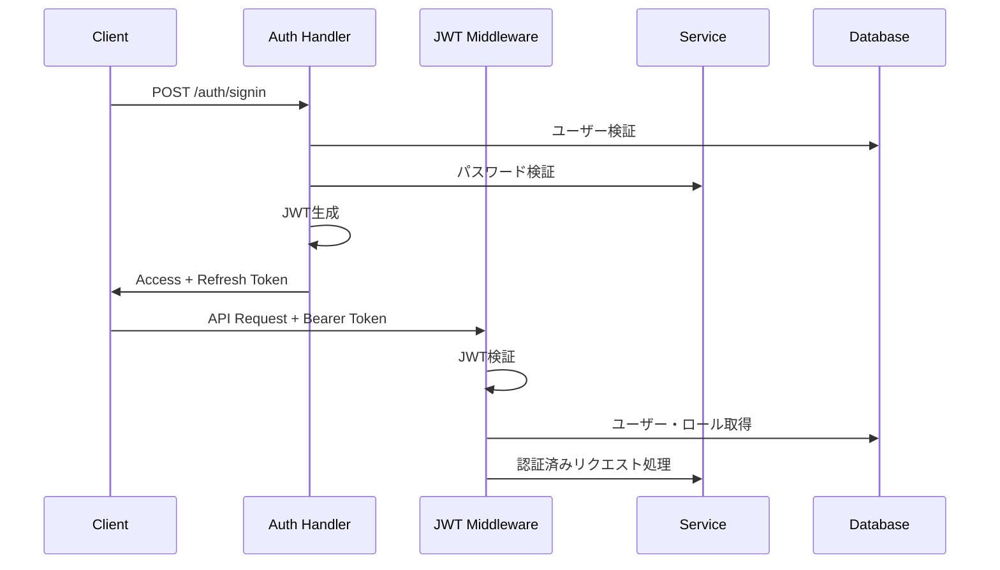
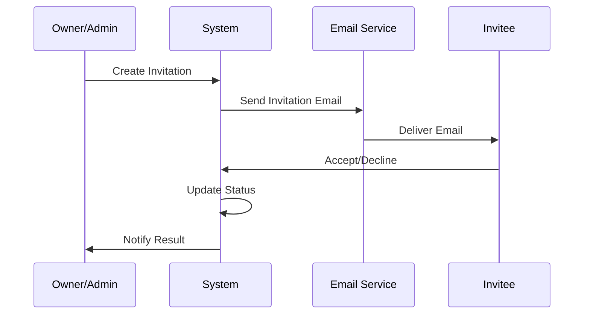

# 🚀 Task Backend System - Feature Design Document

## 📋 目次
- [システム概要](#システム概要)
- [アーキテクチャ](#アーキテクチャ)
- [認証・認可システム](#認証認可システム)
- [動的権限システム](#動的権限システム)
- [サブスクリプション管理](#サブスクリプション管理)
- [タスク管理機能](#タスク管理機能)
- [ユーザー管理機能](#ユーザー管理機能)
- [組織・チーム管理](#組織チーム管理)
- [チーム招待システム](#チーム招待システム)
- [GDPR コンプライアンス](#gdpr-コンプライアンス)
- [分析・メトリクス](#分析メトリクス)
- [セキュリティ機能](#セキュリティ機能)
- [API エンドポイント](#api-エンドポイント)
- [データベース設計](#データベース設計)

---

## 🎯 システム概要

Task Backend Systemは、**動的権限システム**と**サブスクリプション階層**を組み合わせた高度なタスク管理APIです。同一のエンドポイントでも、ユーザーのロール・サブスクリプション・アクセススコープに応じて適切な振る舞いを切り替える柔軟な設計を採用しています。

### 主要特徴
- 🔐 JWT ベースの認証・認可
- 🎭 ロールベース権限管理 (RBAC)
- 💎 サブスクリプション階層 (Free/Pro/Enterprise)
- 🌐 動的スコープ権限 (Own/Team/Organization/Global)
- 📊 特権・クォータ管理
- 🔄 リアルタイム権限切り替え
- 🛡️ 高度なセキュリティ機能（監査ログ、セッション分析）
- 🏢 階層型組織構造（部門管理、権限継承）
- 📧 チーム招待システム
- 🔒 GDPR完全準拠（データエクスポート、削除権、同意管理）
- 📈 包括的な分析・メトリクス機能
- ⚙️ ユーザー設定と一括操作

---

## 🏗️ アーキテクチャ

### レイヤー構成
```
┌─────────────────┐
│   API Layer     │ ← ハンドラー、ミドルウェア
├─────────────────┤
│  Service Layer  │ ← ビジネスロジック、動的権限判定
├─────────────────┤
│Repository Layer │ ← データアクセス
├─────────────────┤
│  Domain Layer   │ ← エンティティ、権限モデル
├─────────────────┤
│ Database Layer  │ ← PostgreSQL、Sea-ORM
└─────────────────┘
```

### 技術スタック
- **Framework**: Axum (Rust)
- **Database**: PostgreSQL + Sea-ORM
- **Authentication**: JWT (jsonwebtoken)
- **Password**: Argon2
- **Validation**: validator
- **Logging**: tracing

---

## 🔐 認証・認可システム

### JWT認証フロー


### 認証ミドルウェア種類

#### 1. 基本認証ミドルウェア (`jwt_auth_middleware`)
- JWTトークン検証
- ユーザー状態確認
- アクセストークン有効期限チェック

#### 2. ロール認識ミドルウェア (`role_aware_auth_middleware`)
- データベースからロール情報取得
- 詳細権限情報付与
- テスト環境での管理者ロール自動生成

#### 3. 管理者専用ミドルウェア (`admin_only_middleware`)
- 管理者権限必須エンドポイント用
- 厳格な権限チェック

#### 4. オプショナル認証ミドルウェア (`optional_auth_middleware`)
- 認証なしでもアクセス可能
- 認証情報があれば追加機能提供

### トークン管理
- **Access Token**: 15分有効、認証情報含む
- **Refresh Token**: 7日有効、トークンローテーション対応
- **Password Reset Token**: 1時間有効、ワンタイム使用

---

## 🎭 動的権限システム

同一のエンドポイントでも、ユーザーの権限に応じて動的に振る舞いを変更する革新的なシステム。

### 権限スコープ
```rust
pub enum PermissionScope {
    Own,          // 自分のデータのみ
    Team,         // チームのデータ
    Organization, // 組織全体
    Global,       // 全データ
}
```

### 特権とクォータ
```rust
pub struct Privilege {
    pub name: String,                        // 特権名
    pub subscription_tier: SubscriptionTier, // 必要階層
    pub quota: Option<PermissionQuota>,      // 制限情報
}

pub struct PermissionQuota {
    pub max_items: Option<u32>,       // 最大取得件数
    pub rate_limit: Option<u32>,      // レート制限
    pub features: Vec<String>,        // 利用可能機能
}
```

### 動的権限判定フロー
```rust
impl TaskService {
    pub async fn list_tasks_dynamic(
        &self,
        user: &AuthenticatedUser,
        filter: Option<TaskFilterDto>,
    ) -> AppResult<TaskResponse> {
        let permission_result = user.claims.can_perform_action("tasks", "read", None);

        match permission_result {
            PermissionResult::Allowed { privilege, scope } => {
                self.execute_task_query(user, filter, privilege, scope).await
            }
            PermissionResult::Denied { reason } => {
                Err(AppError::Forbidden(reason))
            }
        }
    }
}
```

### サブスクリプション別動作

| ユーザー種別        | スコープ      | 最大件数   | 利用可能機能                    |
|-------------------|-------------|-----------|------------------------------|
| Free ユーザー      | Own         | 100件     | 基本フィルタリング               |
| Pro ユーザー       | Team        | 10,000件  | 高度フィルタ、エクスポート         |
| Enterprise ユーザー | Global      | 無制限     | 全機能、一括操作               |
| 管理者             | Global      | 無制限     | 全機能 + 管理者機能            |

---

## 💎 サブスクリプション管理

### サブスクリプション階層
```rust
#[derive(Debug, Clone, Copy, PartialEq, Eq, Hash, Serialize, Deserialize)]
pub enum SubscriptionTier {
    Free,        // レベル1: 基本機能
    Pro,         // レベル2: 拡張機能
    Enterprise,  // レベル3: 全機能
}
```

### 階層比較・判定
```rust
impl SubscriptionTier {
    pub fn level(&self) -> u8 {
        match self {
            Self::Free => 1,
            Self::Pro => 2,
            Self::Enterprise => 3,
        }
    }

    pub fn is_at_least(&self, other: &Self) -> bool {
        self.level() >= other.level()
    }
}
```

### サブスクリプション履歴管理
- ユーザーごとの変更履歴追跡
- アップグレード/ダウングレード記録
- 管理者による強制変更サポート
- 統計情報生成

---

## 📝 タスク管理機能

### CRUD操作
- **作成**: 個別・一括作成対応
- **読み取り**: 権限ベース動的フィルタリング
- **更新**: 個別・一括更新対応  
- **削除**: 個別・一括削除対応

### 動的エンドポイント
```
GET /tasks/dynamic          # 動的権限によるタスク一覧
GET /tasks/dynamic/filter   # 動的フィルタリング
GET /tasks/dynamic/paginated # 動的ページネーション
```

### フィルタリング機能
```rust
#[derive(Debug, Serialize, Deserialize, Default)]
pub struct TaskFilterDto {
    pub status: Option<TaskStatus>,
    pub title: Option<String>,
    pub description: Option<String>,
    pub due_date_from: Option<DateTime<Utc>>,
    pub due_date_to: Option<DateTime<Utc>>,
    pub limit: Option<u64>,
    pub offset: Option<u64>,
    pub sort_by: Option<String>,
    pub sort_order: Option<String>,
}
```

### タスクレスポンス種別
```rust
#[derive(Debug, Serialize)]
pub enum TaskResponse {
    Limited(PaginatedTasksDto),   // 制限あり
    Enhanced(PaginatedTasksDto),  // 拡張機能
    Unlimited(PaginatedTasksDto), // 無制限
}
```

### 一括操作
- **一括作成**: 最大100件同時作成
- **一括更新**: ID指定での部分更新
- **一括削除**: 複数ID指定削除
- **ステータス一括更新**: 指定タスクのステータス変更

---

## 👥 ユーザー管理機能

### プロフィール管理
- **情報取得**: 安全なユーザー情報取得
- **ユーザー名更新**: 重複チェック付き
- **メール更新**: 認証状態管理
- **一括更新**: 複数フィールド同時更新

### アカウント機能
- **メール認証**: 認証トークン管理、履歴追跡
- **パスワード変更**: 強度チェック
- **アカウント削除**: 関連データ完全削除
- **ログイン履歴**: 最終ログイン時刻記録

### ユーザー設定管理
- **言語設定**: 多言語対応
- **タイムゾーン**: ユーザー固有のタイムゾーン
- **通知設定**: メール通知のカスタマイズ
- **UI設定**: インターフェースのパーソナライズ

### 管理者機能
- **ユーザー一覧**: 検索・フィルタ・ページネーション
- **アカウント状態変更**: 有効化/無効化
- **ユーザー詳細取得**: 管理者専用情報表示
- **一括操作**: 複数ユーザーの同時処理
  - アクティベート/非アクティベート
  - メール認証
  - パスワードリセット
  - サブスクリプション更新
  - 一括削除

---

## 🏢 組織・チーム管理

### エンティティ関係図
```
Organizations (組織)
├── Organization Settings (組織設定)
├── Organization Members (組織メンバー)
├── Departments (部門) ← NEW
│   ├── Department Members (部門メンバー)
│   └── Sub-departments (子部門)
├── Teams (チーム)
│   ├── Team Members (チームメンバー)
│   └── Team Invitations (チーム招待)
└── Permission Matrix (権限マトリックス) ← NEW
```

### 階層構造と権限

#### 組織レベル権限
- **Owner** (レベル: 3) - 組織の完全制御
- **Admin** (レベル: 2) - 組織管理権限
- **Member** (レベル: 1) - 基本参加権限

#### チームレベル権限
- **Owner** (レベル: 4) - チームの完全制御
- **Admin** (レベル: 3) - チーム管理権限
- **Member** (レベル: 2) - 基本参加権限
- **Viewer** (レベル: 1) - 閲覧のみ

### サブスクリプション制限

#### 組織制限
- **Free**: 3チーム、10メンバー
- **Pro**: 20チーム、100メンバー
- **Enterprise**: 100チーム、1000メンバー

#### チーム制限
- **Free**: 3メンバー
- **Pro**: 10メンバー
- **Enterprise**: 100メンバー

### 組織設定
```rust
pub struct OrganizationSettings {
    pub allow_public_teams: bool,              // 公開チームの許可
    pub require_approval_for_new_members: bool, // 新メンバー承認必須
    pub enable_single_sign_on: bool,           // SSO有効化
    pub default_team_subscription_tier: SubscriptionTier, // デフォルト階層
}
```

### 階層型部門管理
- **部門階層**: 無制限の階層深度をサポート
- **権限継承**: 親部門から子部門への権限継承
- **部門別分析**: 部門ごとのパフォーマンス分析
- **コンプライアンス設定**: 部門固有のコンプライアンス要件

### 権限マトリックス
- **エンティティベース権限**: 組織・チーム・部門単位での権限設定
- **アクション権限**: Create, Read, Update, Delete, Manage
- **権限継承ルール**: 上位階層からの権限継承と上書き
- **効果的権限分析**: 実際に適用される権限の可視化

---

## 🎫 チーム招待システム

### 招待フロー


### 招待機能
- **単一招待**: 個別のメールアドレスへの招待
- **一括招待**: 複数メンバーの同時招待
- **招待期限**: 7日間の有効期限
- **再送信**: 期限切れ前の再送信機能
- **キャンセル**: 送信済み招待のキャンセル

### 招待ステータス
- `Pending`: 承認待ち
- `Accepted`: 承認済み
- `Declined`: 拒否
- `Expired`: 期限切れ
- `Cancelled`: キャンセル済み

---

## 🔒 GDPR コンプライアンス

### データ主体の権利
1. **アクセス権**: 個人データへのアクセス
2. **訂正権**: 不正確なデータの修正
3. **削除権（忘れられる権利）**: データの完全削除
4. **データポータビリティ権**: データのエクスポート
5. **処理制限権**: データ処理の制限
6. **異議申立権**: データ処理への異議

### 同意管理
```rust
pub enum ConsentType {
    Marketing,      // マーケティング目的
    Analytics,      // 分析目的
    ThirdParty,     // 第三者共有
}

pub struct UserConsent {
    pub consent_type: ConsentType,
    pub granted: bool,
    pub granted_at: Option<DateTime<Utc>>,
    pub ip_address: Option<String>,
}
```

### データエクスポート機能
- **対象データ**:
  - ユーザープロフィール
  - タスク情報
  - チーム・組織メンバーシップ
  - アクティビティログ
  - サブスクリプション履歴
- **フォーマット**: JSON形式
- **セキュリティ**: 本人確認後のみ実行

### データ削除機能
- **カスケード削除**: 関連データの完全削除
- **削除対象**:
  - ユーザーアカウント
  - 所有タスク
  - 所有チーム
  - メンバーシップ
  - アクティビティログ
  - トークン情報
- **削除記録**: 削除操作の監査証跡

---

## 📊 分析・メトリクス

### システム分析
```rust
pub struct SystemAnalytics {
    pub total_users: u64,
    pub active_users_24h: u64,
    pub total_tasks: u64,
    pub database_size_mb: f64,
    pub uptime_percentage: f64,
    pub performance_metrics: PerformanceMetrics,
}
```

### ユーザー行動分析
- **アクティビティ追跡**: すべてのユーザーアクションを記録
- **セッション分析**: ログイン時間、滞在時間、アクション数
- **生産性スコア**: タスク完了率、平均完了時間
- **エンゲージメント**: 機能使用頻度、ログイン頻度

### 機能使用状況分析
```rust
pub struct FeatureUsageMetrics {
    pub feature_name: String,
    pub usage_count: u64,
    pub unique_users: u64,
    pub avg_time_spent_ms: f64,
    pub adoption_rate: f64,
    pub proficiency_levels: HashMap<String, u32>,
}
```

### サブスクリプション分析
- **コンバージョン率**: Free→Pro→Enterprise
- **チャーン率**: 解約率の追跡
- **MRR（月間経常収益）**: 収益予測
- **利用率**: プラン別機能利用状況

### 日次サマリー
- **自動集計**: 毎日の活動を自動集計
- **成長率計算**: 前日比、前週比、前月比
- **トレンド分析**: 長期的な傾向の把握
- **異常検知**: 通常と異なるパターンの検出

---

## 🔗 API エンドポイント

### 認証関連
```
POST   /auth/signup           # ユーザー登録
POST   /auth/signin           # ログイン
POST   /auth/signout          # ログアウト
POST   /auth/refresh          # トークン更新
POST   /auth/forgot-password  # パスワードリセット要求
POST   /auth/reset-password   # パスワードリセット実行
GET    /auth/verify-email     # メール認証
POST   /auth/resend-verification # 認証メール再送信
```

### タスク管理
```
# 基本CRUD
GET    /tasks                 # タスク一覧
POST   /tasks                 # タスク作成
GET    /tasks/{id}            # タスク取得
PATCH  /tasks/{id}            # タスク更新
DELETE /tasks/{id}            # タスク削除

# 動的権限エンドポイント
GET    /tasks/dynamic         # 動的権限タスク一覧
GET    /tasks/dynamic/filter  # 動的フィルタリング
GET    /tasks/dynamic/paginated # 動的ページネーション

# 一括操作
POST   /tasks/batch/create    # 一括作成
PATCH  /tasks/batch/update    # 一括更新
POST   /tasks/batch/delete    # 一括削除
PATCH  /tasks/batch/status    # ステータス一括更新

# ユーティリティ
GET    /tasks/filter          # フィルタリング
GET    /tasks/paginated       # ページネーション
GET    /tasks/stats           # 統計情報
```

### ユーザー管理
```
# プロフィール
GET    /users/profile         # プロフィール取得
PATCH  /users/profile         # プロフィール更新
PATCH  /users/profile/username # ユーザー名更新
PATCH  /users/profile/email   # メール更新
DELETE /users/profile         # アカウント削除

# 設定
GET    /users/settings        # 設定取得
PATCH  /users/settings        # 設定更新

# 統計・分析
GET    /users/stats           # ユーザー統計
GET    /users/permissions     # ユーザー権限一覧
GET    /users/invitations     # 受信した招待一覧

# 管理者専用
GET    /admin/users           # ユーザー一覧
GET    /admin/users/{id}      # ユーザー詳細
PATCH  /admin/users/{id}/status # アカウント状態変更
POST   /admin/users/bulk      # 一括操作
DELETE /admin/users/{id}      # ユーザー削除（管理者）
```

### サブスクリプション
```
GET    /subscriptions/current # 現在のサブスクリプション
POST   /subscriptions/upgrade # アップグレード
POST   /subscriptions/downgrade # ダウングレード
GET    /subscriptions/history # 変更履歴
GET    /subscriptions/analytics # サブスクリプション分析

# 管理者専用
GET    /admin/subscriptions   # 全サブスクリプション一覧
GET    /admin/subscriptions/stats # サブスクリプション統計
GET    /admin/subscriptions/analytics # 詳細分析
PATCH  /admin/users/{id}/subscription # 管理者変更
DELETE /admin/users/{id}/subscription/history # 履歴削除
```

### 組織・チーム管理
```
# 組織管理
GET    /organizations         # 組織一覧
POST   /organizations         # 組織作成
GET    /organizations/{id}    # 組織詳細
PATCH  /organizations/{id}    # 組織更新
DELETE /organizations/{id}    # 組織削除
GET    /organizations/{id}/capacity # 容量チェック
GET    /organizations/{id}/stats # 組織統計

# 組織設定
PATCH  /organizations/{id}/settings # 設定更新
PUT    /organizations/{id}/subscription # サブスクリプション更新
GET    /organizations/{id}/subscription/history # 変更履歴

# 組織階層
GET    /organizations/{id}/hierarchy # 階層構造取得
GET    /organizations/{id}/departments # 部門一覧
POST   /organizations/{id}/departments # 部門作成
PATCH  /organizations/{id}/departments/{dept_id} # 部門更新
DELETE /organizations/{id}/departments/{dept_id} # 部門削除
POST   /organizations/{id}/departments/{dept_id}/members # 部門メンバー追加
DELETE /organizations/{id}/departments/{dept_id}/members/{user_id} # 部門メンバー削除

# 権限マトリックス
GET    /organizations/{id}/permission-matrix # 権限マトリックス取得
PUT    /organizations/{id}/permission-matrix # 権限マトリックス更新
GET    /organizations/{id}/effective-permissions # 有効権限分析

# 組織分析
GET    /organizations/{id}/analytics # 組織分析
POST   /organizations/{id}/data-export # データエクスポート

# チーム管理
GET    /teams                 # チーム一覧
POST   /teams                 # チーム作成
GET    /teams/{id}            # チーム詳細
PATCH  /teams/{id}            # チーム更新
DELETE /teams/{id}            # チーム削除
GET    /teams/{id}/stats      # チーム統計

# チーム招待
GET    /teams/{id}/invitations # 招待一覧
POST   /teams/{id}/invitations/single # 単一招待
POST   /teams/{id}/invitations/bulk # 一括招待
POST   /teams/{id}/invitations/{inv_id}/accept # 承認
POST   /teams/{id}/invitations/{inv_id}/decline # 拒否
DELETE /teams/{id}/invitations/{inv_id}/cancel # キャンセル
POST   /teams/{id}/invitations/{inv_id}/resend # 再送信
GET    /teams/{id}/invitations/statistics # 招待統計

# メンバーシップ管理
GET    /organizations/{id}/members # 組織メンバー一覧
POST   /organizations/{id}/members # 組織メンバー追加
GET    /organizations/{id}/members/{member_id} # メンバー詳細
PATCH  /organizations/{id}/members/{member_id}/role # 役割更新
DELETE /organizations/{id}/members/{member_id} # 組織メンバー削除
GET    /teams/{id}/members    # チームメンバー一覧
POST   /teams/{id}/members    # チームメンバー追加
PATCH  /teams/{id}/members/{user_id}/role # 役割更新
DELETE /teams/{id}/members/{user_id} # チームメンバー削除
```

### GDPR コンプライアンス
```
# ユーザーデータ管理
POST   /gdpr/users/{user_id}/export # データエクスポート
DELETE /gdpr/users/{user_id}/delete # データ削除
GET    /gdpr/users/{user_id}/status # コンプライアンス状態

# 同意管理
GET    /gdpr/users/{user_id}/consents # 同意一覧
POST   /gdpr/users/{user_id}/consents # 同意更新（一括）
PATCH  /gdpr/users/{user_id}/consents/single # 単一同意更新
GET    /gdpr/users/{user_id}/consents/history # 同意履歴

# 管理者専用
POST   /admin/gdpr/users/{user_id}/export # 管理者によるエクスポート
DELETE /admin/gdpr/users/{user_id}/delete # 管理者による削除
```

### 分析・レポート
```
# システム分析
GET    /admin/analytics/system # システム全体分析
GET    /admin/analytics/system/stats # 詳細統計
POST   /admin/analytics/daily-summary/update # 日次サマリー更新

# ユーザー分析
GET    /analytics/activity    # アクティビティ分析
GET    /analytics/tasks       # タスク統計
GET    /analytics/behavior    # 行動分析
GET    /admin/analytics/users/{id}/activity # ユーザー活動（管理者）

# 機能使用状況
POST   /analytics/track-feature # 機能使用追跡
GET    /admin/analytics/features/usage # 使用統計

# エクスポート
POST   /exports/advanced      # 高度なデータエクスポート
```

### セキュリティ
```
# トークン管理
GET    /admin/security/token-stats # トークン統計
GET    /admin/security/refresh-tokens # リフレッシュトークン監視
POST   /admin/security/cleanup-tokens # 期限切れトークン削除
GET    /admin/security/password-resets # パスワードリセット監視
POST   /admin/security/revoke-all-tokens # 全トークン無効化

# セッション・監査
GET    /admin/security/session-analytics # セッション分析
POST   /admin/security/audit-report # 監査レポート生成

# 権限管理
GET    /permissions/check     # 権限チェック
GET    /permissions/resources # リソース権限一覧
```

### 管理者ツール
```
# 招待管理
POST   /admin/invitations/cleanup # 期限切れ招待削除

# システム管理
GET    /admin/system/health   # ヘルスチェック
GET    /admin/system/metrics  # システムメトリクス
POST   /admin/system/maintenance # メンテナンスモード
```

---

## 🗄️ データベース設計

### 主要テーブル

#### users テーブル
```sql
CREATE TABLE users (
    id UUID PRIMARY KEY DEFAULT gen_random_uuid(),
    email VARCHAR UNIQUE NOT NULL,
    username VARCHAR UNIQUE NOT NULL,
    password_hash VARCHAR NOT NULL,
    is_active BOOLEAN DEFAULT true,
    email_verified BOOLEAN DEFAULT false,
    role_id UUID NOT NULL REFERENCES roles(id),
    subscription_tier VARCHAR DEFAULT 'free',
    last_login_at TIMESTAMPTZ,
    created_at TIMESTAMPTZ DEFAULT now(),
    updated_at TIMESTAMPTZ DEFAULT now()
);
```

#### roles テーブル
```sql
CREATE TABLE roles (
    id UUID PRIMARY KEY DEFAULT gen_random_uuid(),
    name VARCHAR UNIQUE NOT NULL,
    display_name VARCHAR NOT NULL,
    description TEXT,
    is_active BOOLEAN DEFAULT true,
    created_at TIMESTAMPTZ DEFAULT now(),
    updated_at TIMESTAMPTZ DEFAULT now()
);
```

#### tasks テーブル
```sql
CREATE TABLE tasks (
    id UUID PRIMARY KEY DEFAULT gen_random_uuid(),
    user_id UUID NOT NULL REFERENCES users(id) ON DELETE CASCADE,
    title VARCHAR NOT NULL,
    description TEXT,
    status VARCHAR DEFAULT 'todo',
    due_date TIMESTAMPTZ,
    created_at TIMESTAMPTZ DEFAULT now(),
    updated_at TIMESTAMPTZ DEFAULT now()
);
```

#### organizations テーブル
```sql
CREATE TABLE organizations (
    id UUID PRIMARY KEY DEFAULT gen_random_uuid(),
    name VARCHAR NOT NULL,
    description TEXT,
    owner_id UUID NOT NULL REFERENCES users(id) ON DELETE CASCADE,
    subscription_tier VARCHAR DEFAULT 'free',
    max_teams INTEGER DEFAULT 3,
    max_members INTEGER DEFAULT 10,
    created_at TIMESTAMPTZ DEFAULT now(),
    updated_at TIMESTAMPTZ DEFAULT now()
);
```

#### teams テーブル
```sql
CREATE TABLE teams (
    id UUID PRIMARY KEY DEFAULT gen_random_uuid(),
    name VARCHAR NOT NULL,
    description TEXT,
    organization_id UUID REFERENCES organizations(id) ON DELETE SET NULL,
    owner_id UUID NOT NULL REFERENCES users(id) ON DELETE CASCADE,
    max_members INTEGER DEFAULT 3,
    created_at TIMESTAMPTZ DEFAULT now(),
    updated_at TIMESTAMPTZ DEFAULT now()
);
```

#### user_settings テーブル
```sql
CREATE TABLE user_settings (
    id UUID PRIMARY KEY DEFAULT gen_random_uuid(),
    user_id UUID UNIQUE NOT NULL REFERENCES users(id) ON DELETE CASCADE,
    language VARCHAR DEFAULT 'en',
    timezone VARCHAR DEFAULT 'UTC',
    email_notifications JSONB DEFAULT '{}',
    ui_preferences JSONB DEFAULT '{}',
    created_at TIMESTAMPTZ DEFAULT now(),
    updated_at TIMESTAMPTZ DEFAULT now()
);
```

#### user_consents テーブル
```sql
CREATE TABLE user_consents (
    id UUID PRIMARY KEY DEFAULT gen_random_uuid(),
    user_id UUID NOT NULL REFERENCES users(id) ON DELETE CASCADE,
    consent_type VARCHAR NOT NULL,
    granted BOOLEAN NOT NULL DEFAULT false,
    granted_at TIMESTAMPTZ,
    revoked_at TIMESTAMPTZ,
    ip_address VARCHAR,
    user_agent TEXT,
    created_at TIMESTAMPTZ DEFAULT now(),
    updated_at TIMESTAMPTZ DEFAULT now(),
    UNIQUE(user_id, consent_type)
);
```

#### activity_logs テーブル
```sql
CREATE TABLE activity_logs (
    id UUID PRIMARY KEY DEFAULT gen_random_uuid(),
    user_id UUID NOT NULL REFERENCES users(id) ON DELETE CASCADE,
    action VARCHAR NOT NULL,
    resource_type VARCHAR NOT NULL,
    resource_id UUID,
    ip_address VARCHAR,
    user_agent TEXT,
    success BOOLEAN NOT NULL DEFAULT true,
    error_message TEXT,
    created_at TIMESTAMPTZ DEFAULT now()
);
```

#### security_incidents テーブル
```sql
CREATE TABLE security_incidents (
    id UUID PRIMARY KEY DEFAULT gen_random_uuid(),
    incident_type VARCHAR NOT NULL,
    severity VARCHAR NOT NULL,
    description TEXT NOT NULL,
    affected_user_id UUID REFERENCES users(id) ON DELETE SET NULL,
    ip_address VARCHAR,
    resolved BOOLEAN DEFAULT false,
    resolved_at TIMESTAMPTZ,
    resolved_by UUID REFERENCES users(id) ON DELETE SET NULL,
    resolution_notes TEXT,
    created_at TIMESTAMPTZ DEFAULT now(),
    updated_at TIMESTAMPTZ DEFAULT now()
);
```

#### feature_usage_metrics テーブル
```sql
CREATE TABLE feature_usage_metrics (
    id UUID PRIMARY KEY DEFAULT gen_random_uuid(),
    user_id UUID NOT NULL REFERENCES users(id) ON DELETE CASCADE,
    feature_name VARCHAR NOT NULL,
    usage_count INTEGER DEFAULT 0,
    total_time_spent_ms BIGINT DEFAULT 0,
    last_used_at TIMESTAMPTZ,
    proficiency_level INTEGER DEFAULT 1,
    created_at TIMESTAMPTZ DEFAULT now(),
    updated_at TIMESTAMPTZ DEFAULT now(),
    UNIQUE(user_id, feature_name)
);
```

#### organization_departments テーブル
```sql
CREATE TABLE organization_departments (
    id UUID PRIMARY KEY DEFAULT gen_random_uuid(),
    organization_id UUID NOT NULL REFERENCES organizations(id) ON DELETE CASCADE,
    parent_department_id UUID REFERENCES organization_departments(id) ON DELETE CASCADE,
    name VARCHAR NOT NULL,
    description TEXT,
    budget DECIMAL(15,2),
    compliance_settings JSONB DEFAULT '{}',
    created_at TIMESTAMPTZ DEFAULT now(),
    updated_at TIMESTAMPTZ DEFAULT now(),
    UNIQUE(organization_id, name)
);
```

#### permission_matrices テーブル
```sql
CREATE TABLE permission_matrices (
    id UUID PRIMARY KEY DEFAULT gen_random_uuid(),
    organization_id UUID NOT NULL REFERENCES organizations(id) ON DELETE CASCADE,
    entity_type VARCHAR NOT NULL,
    entity_id UUID NOT NULL,
    role VARCHAR NOT NULL,
    permissions JSONB NOT NULL DEFAULT '{}',
    created_at TIMESTAMPTZ DEFAULT now(),
    updated_at TIMESTAMPTZ DEFAULT now(),
    UNIQUE(organization_id, entity_type, entity_id, role)
);
```

### 外部キー制約設計

#### CASCADE削除（親削除→子削除）
- 組織オーナー削除 → 組織削除
- チームオーナー削除 → チーム削除  
- ユーザー削除 → メンバーシップ削除

#### SET NULL（親削除→NULL設定）
- 組織削除 → チームのorganization_id がNULL
- 招待者削除 → invited_by がNULL

---

## 🛡️ セキュリティ機能

### パスワードセキュリティ
- **Argon2**: 最新の暗号化アルゴリズム
- **強度チェック**: 8文字以上、複雑性要件
- **自動再ハッシュ**: パラメータ更新時の自動対応

### JWT セキュリティ
- **短命アクセストークン**: 15分有効
- **トークンローテーション**: リフレッシュ時に新トークン発行
- **自動無効化**: パスワード変更時の全トークン無効化
- **トークン監視**: 使用状況の追跡と分析

### 高度なセキュリティ機能

#### アクティビティログ
```rust
pub struct ActivityLog {
    pub user_id: Uuid,
    pub action: String,
    pub resource_type: String,
    pub resource_id: Option<Uuid>,
    pub ip_address: Option<String>,
    pub user_agent: Option<String>,
    pub success: bool,
    pub error_message: Option<String>,
    pub created_at: DateTime<Utc>,
}
```

#### ログイン試行追跡
- **失敗回数制限**: 5回失敗でアカウントロック
- **IPアドレス追跡**: 不審なアクセスパターン検出
- **地理的分析**: 異常なログイン場所の検出

#### セキュリティインシデント管理
```rust
pub enum IncidentSeverity {
    Low,      // 軽微な問題
    Medium,   // 中程度の脅威
    High,     // 重大な脅威
    Critical, // 緊急対応必要
}

pub struct SecurityIncident {
    pub incident_type: String,
    pub severity: IncidentSeverity,
    pub description: String,
    pub affected_user_id: Option<Uuid>,
    pub ip_address: Option<String>,
    pub resolved: bool,
    pub resolution_notes: Option<String>,
}
```

#### セッション分析
- **アクティブセッション監視**: リアルタイムセッション追跡
- **異常セッション検出**: 通常と異なるパターンの検出
- **地理的分散**: セッションの地理的分布
- **デバイス分析**: 使用デバイスの追跡

#### 監査機能
- **包括的な監査ログ**: すべての重要操作を記録
- **監査レポート生成**: コンプライアンス用レポート
- **改ざん防止**: 監査ログの不変性保証
- **定期監査**: 自動監査スケジューリング

### API セキュリティ
- **CORS設定**: 適切なオリジン制限
- **セキュリティヘッダー**: XSS、CSRF対策
- **レート制限**: API濫用防止（実装準備中）
- **入力検証**: 全入力の厳格なバリデーション

### データベースセキュリティ
- **CASCADE削除**: データ整合性保証
- **インデックス最適化**: パフォーマンス向上
- **トランザクション管理**: データ一貫性保証

---

## 🧪 テスト・開発機能

### テスト環境サポート
- **自動管理者ロール**: テスト時の権限自動付与
- **モックデータ**: 開発用のサンプルデータ
- **環境分離**: 本番・開発・テスト環境の分離

### ログ・監視
- **構造化ログ**: tracing による詳細ログ
- **権限監査**: 全権限チェックの記録
- **パフォーマンス監視**: 処理時間の追跡

### 拡張性
- **モジュラー設計**: 機能の独立性
- **設定駆動**: 環境変数による動的設定
- **スケーラビリティ**: 水平スケーリング対応設計

---

## 🔄 今後の拡張計画

### 追加予定機能
- **リアルタイム通知**: WebSocket による即座更新
- **ファイル添付**: タスクへのファイル添付機能
- **レポート機能**: 詳細な分析・レポート生成
- **API レート制限**: より詳細な制限機能
- **監査ログ**: 全操作の詳細記録

### 技術的改善
- **キャッシュ層**: Redis による高速化
- **メッセージキュー**: 非同期処理の導入
- **マイクロサービス**: サービス分割による拡張性向上
- **GraphQL**: より柔軟なAPI提供

---

この設計文書は、現在の実装に基づいて作成され、システムの全体像と各機能の詳細を包括的にカバーしています。動的権限システムとサブスクリプション管理を中核とした革新的なアーキテクチャにより、柔軟で拡張性の高いタスク管理システムを実現しています。