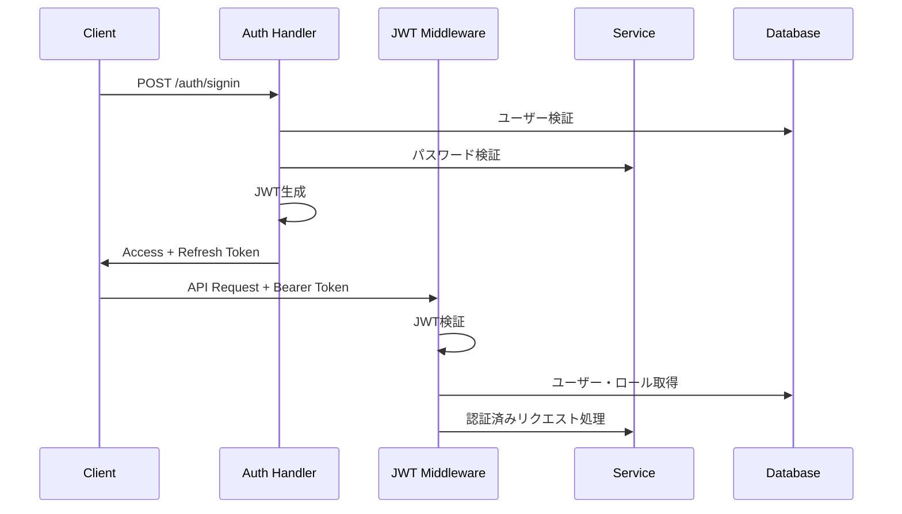

# 🚀 Task Backend System - Feature Design Document

## 📋 目次
- [システム概要](#システム概要)
- [アーキテクチャ](#アーキテクチャ)
- [認証・認可システム](#認証認可システム)
- [動的権限システム](#動的権限システム)
- [サブスクリプション管理](#サブスクリプション管理)
- [タスク管理機能](#タスク管理機能)
- [ユーザー管理機能](#ユーザー管理機能)
- [API エンドポイント](#api-エンドポイント)
- [データベース設計](#データベース設計)
- [セキュリティ機能](#セキュリティ機能)

---

## 🎯 システム概要

Task Backend Systemは、**動的権限システム**と**サブスクリプション階層**を組み合わせた高度なタスク管理APIです。同一のエンドポイントでも、ユーザーのロール・サブスクリプション・アクセススコープに応じて適切な振る舞いを切り替える柔軟な設計を採用しています。

### 主要特徴
- 🔐 JWT ベースの認証・認可
- 🎭 ロールベース権限管理 (RBAC)
- 💎 サブスクリプション階層 (Free/Pro/Enterprise)
- 🌐 動的スコープ権限 (Own/Team/Organization/Global)
- 📊 特権・クォータ管理
- 🔄 リアルタイム権限切り替え
- 🛡️ セキュリティ強化

---

## 🏗️ アーキテクチャ

### レイヤー構成
```
┌─────────────────┐
│   API Layer     │ ← ハンドラー、ミドルウェア
├─────────────────┤
│  Service Layer  │ ← ビジネスロジック、動的権限判定
├─────────────────┤
│Repository Layer │ ← データアクセス
├─────────────────┤
│  Domain Layer   │ ← エンティティ、権限モデル
├─────────────────┤
│ Database Layer  │ ← PostgreSQL、Sea-ORM
└─────────────────┘
```

### 技術スタック
- **Framework**: Axum (Rust)
- **Database**: PostgreSQL + Sea-ORM
- **Authentication**: JWT (jsonwebtoken)
- **Password**: Argon2
- **Validation**: validator
- **Logging**: tracing

---

## 🔐 認証・認可システム

### JWT認証フロー


### 認証ミドルウェア種類

#### 1. 基本認証ミドルウェア (`jwt_auth_middleware`)
- JWTトークン検証
- ユーザー状態確認
- アクセストークン有効期限チェック

#### 2. ロール認識ミドルウェア (`role_aware_auth_middleware`)
- データベースからロール情報取得
- 詳細権限情報付与
- テスト環境での管理者ロール自動生成

#### 3. 管理者専用ミドルウェア (`admin_only_middleware`)
- 管理者権限必須エンドポイント用
- 厳格な権限チェック

#### 4. オプショナル認証ミドルウェア (`optional_auth_middleware`)
- 認証なしでもアクセス可能
- 認証情報があれば追加機能提供

### トークン管理
- **Access Token**: 15分有効、認証情報含む
- **Refresh Token**: 7日有効、トークンローテーション対応
- **Password Reset Token**: 1時間有効、ワンタイム使用

---

## 🎭 動的権限システム

同一のエンドポイントでも、ユーザーの権限に応じて動的に振る舞いを変更する革新的なシステム。

### 権限スコープ
```rust
pub enum PermissionScope {
    Own,          // 自分のデータのみ
    Team,         // チームのデータ
    Organization, // 組織全体
    Global,       // 全データ
}
```

### 特権とクォータ
```rust
pub struct Privilege {
    pub name: String,                        // 特権名
    pub subscription_tier: SubscriptionTier, // 必要階層
    pub quota: Option<PermissionQuota>,      // 制限情報
}

pub struct PermissionQuota {
    pub max_items: Option<u32>,       // 最大取得件数
    pub rate_limit: Option<u32>,      // レート制限
    pub features: Vec<String>,        // 利用可能機能
}
```

### 動的権限判定フロー
```rust
impl TaskService {
    pub async fn list_tasks_dynamic(
        &self,
        user: &AuthenticatedUser,
        filter: Option<TaskFilterDto>,
    ) -> AppResult<TaskResponse> {
        let permission_result = user.claims.can_perform_action("tasks", "read", None);

        match permission_result {
            PermissionResult::Allowed { privilege, scope } => {
                self.execute_task_query(user, filter, privilege, scope).await
            }
            PermissionResult::Denied { reason } => {
                Err(AppError::Forbidden(reason))
            }
        }
    }
}
```

### サブスクリプション別動作

| ユーザー種別        | スコープ      | 最大件数   | 利用可能機能                    |
|-------------------|-------------|-----------|------------------------------|
| Free ユーザー      | Own         | 100件     | 基本フィルタリング               |
| Pro ユーザー       | Team        | 10,000件  | 高度フィルタ、エクスポート         |
| Enterprise ユーザー | Global      | 無制限     | 全機能、一括操作               |
| 管理者             | Global      | 無制限     | 全機能 + 管理者機能            |

---

## 💎 サブスクリプション管理

### サブスクリプション階層
```rust
#[derive(Debug, Clone, Copy, PartialEq, Eq, Hash, Serialize, Deserialize)]
pub enum SubscriptionTier {
    Free,        // レベル1: 基本機能
    Pro,         // レベル2: 拡張機能
    Enterprise,  // レベル3: 全機能
}
```

### 階層比較・判定
```rust
impl SubscriptionTier {
    pub fn level(&self) -> u8 {
        match self {
            Self::Free => 1,
            Self::Pro => 2,
            Self::Enterprise => 3,
        }
    }

    pub fn is_at_least(&self, other: &Self) -> bool {
        self.level() >= other.level()
    }
}
```

### サブスクリプション履歴管理
- ユーザーごとの変更履歴追跡
- アップグレード/ダウングレード記録
- 管理者による強制変更サポート
- 統計情報生成

---

## 📝 タスク管理機能

### CRUD操作
- **作成**: 個別・一括作成対応
- **読み取り**: 権限ベース動的フィルタリング
- **更新**: 個別・一括更新対応  
- **削除**: 個別・一括削除対応

### 動的エンドポイント
```
GET /tasks/dynamic          # 動的権限によるタスク一覧
GET /tasks/dynamic/filter   # 動的フィルタリング
GET /tasks/dynamic/paginated # 動的ページネーション
```

### フィルタリング機能
```rust
#[derive(Debug, Serialize, Deserialize, Default)]
pub struct TaskFilterDto {
    pub status: Option<TaskStatus>,
    pub title: Option<String>,
    pub description: Option<String>,
    pub due_date_from: Option<DateTime<Utc>>,
    pub due_date_to: Option<DateTime<Utc>>,
    pub limit: Option<u64>,
    pub offset: Option<u64>,
    pub sort_by: Option<String>,
    pub sort_order: Option<String>,
}
```

### タスクレスポンス種別
```rust
#[derive(Debug, Serialize)]
pub enum TaskResponse {
    Limited(PaginatedTasksDto),   // 制限あり
    Enhanced(PaginatedTasksDto),  // 拡張機能
    Unlimited(PaginatedTasksDto), // 無制限
}
```

### 一括操作
- **一括作成**: 最大100件同時作成
- **一括更新**: ID指定での部分更新
- **一括削除**: 複数ID指定削除
- **ステータス一括更新**: 指定タスクのステータス変更

---

## 👥 ユーザー管理機能

### プロフィール管理
- **情報取得**: 安全なユーザー情報取得
- **ユーザー名更新**: 重複チェック付き
- **メール更新**: 認証状態管理
- **一括更新**: 複数フィールド同時更新

### アカウント機能
- **メール認証**: 認証トークン管理
- **パスワード変更**: 強度チェック
- **アカウント削除**: 関連データ完全削除
- **ログイン履歴**: 最終ログイン時刻記録

### 管理者機能
- **ユーザー一覧**: 検索・フィルタ・ページネーション
- **アカウント状態変更**: 有効化/無効化
- **ユーザー詳細取得**: 管理者専用情報表示

---

## 🏢 組織・チーム管理（階層構造）

### エンティティ関係図
```
Organizations (組織)
├── Organization Members (組織メンバー)
├── Teams (チーム)
│   └── Team Members (チームメンバー)
└── Users (ユーザー) + Roles (ロール)
    └── Tasks (タスク)
```

### 階層構造と権限

#### 組織レベル権限
- **Owner** (レベル: 3) - 組織の完全制御
- **Admin** (レベル: 2) - 組織管理権限
- **Member** (レベル: 1) - 基本参加権限

#### チームレベル権限
- **Owner** (レベル: 4) - チームの完全制御
- **Admin** (レベル: 3) - チーム管理権限
- **Member** (レベル: 2) - 基本参加権限
- **Viewer** (レベル: 1) - 閲覧のみ

### サブスクリプション制限

#### 組織制限
- **Free**: 3チーム、10メンバー
- **Pro**: 20チーム、100メンバー
- **Enterprise**: 100チーム、1000メンバー

#### チーム制限
- **Free**: 3メンバー
- **Pro**: 10メンバー
- **Enterprise**: 100メンバー

---

## 🔗 API エンドポイント

### 認証関連
```
POST   /auth/signup           # ユーザー登録
POST   /auth/signin           # ログイン
POST   /auth/signout          # ログアウト
POST   /auth/refresh          # トークン更新
POST   /auth/forgot-password  # パスワードリセット要求
POST   /auth/reset-password   # パスワードリセット実行
```

### タスク管理
```
# 基本CRUD
GET    /tasks                 # タスク一覧
POST   /tasks                 # タスク作成
GET    /tasks/{id}            # タスク取得
PATCH  /tasks/{id}            # タスク更新
DELETE /tasks/{id}            # タスク削除

# 動的権限エンドポイント
GET    /tasks/dynamic         # 動的権限タスク一覧
GET    /tasks/dynamic/filter  # 動的フィルタリング
GET    /tasks/dynamic/paginated # 動的ページネーション

# 一括操作
POST   /tasks/batch/create    # 一括作成
PATCH  /tasks/batch/update    # 一括更新
POST   /tasks/batch/delete    # 一括削除
PATCH  /tasks/batch/status    # ステータス一括更新

# ユーティリティ
GET    /tasks/filter          # フィルタリング
GET    /tasks/paginated       # ページネーション
GET    /tasks/stats           # 統計情報
```

### ユーザー管理
```
# プロフィール
GET    /users/profile         # プロフィール取得
PATCH  /users/profile         # プロフィール更新
PATCH  /users/profile/username # ユーザー名更新
PATCH  /users/profile/email   # メール更新

# アカウント
GET    /users/stats           # ユーザー統計
GET    /users/settings        # 設定取得
POST   /users/verify-email    # メール認証
POST   /users/resend-verification # 認証メール再送

# 管理者専用
GET    /admin/users           # ユーザー一覧
GET    /admin/users/{id}      # ユーザー詳細
PATCH  /admin/users/{id}/status # アカウント状態変更
```

### サブスクリプション
```
GET    /subscriptions/current # 現在のサブスクリプション
POST   /subscriptions/upgrade # アップグレード
POST   /subscriptions/downgrade # ダウングレード
GET    /subscriptions/history # 変更履歴

# 管理者専用
GET    /admin/subscriptions/stats # サブスクリプション統計
PATCH  /admin/users/{id}/subscription # 管理者変更
```

### 組織・チーム管理
```
# 組織管理
GET    /organizations         # 組織一覧
POST   /organizations         # 組織作成
GET    /organizations/{id}    # 組織詳細
PATCH  /organizations/{id}    # 組織更新
DELETE /organizations/{id}    # 組織削除

# チーム管理
GET    /teams                 # チーム一覧
POST   /teams                 # チーム作成
GET    /teams/{id}            # チーム詳細
PATCH  /teams/{id}            # チーム更新
DELETE /teams/{id}            # チーム削除

# メンバーシップ管理
POST   /organizations/{id}/members # 組織メンバー追加
DELETE /organizations/{id}/members/{user_id} # 組織メンバー削除
POST   /teams/{id}/members    # チームメンバー追加
DELETE /teams/{id}/members/{user_id} # チームメンバー削除
```

---

## 🗄️ データベース設計

### 主要テーブル

#### users テーブル
```sql
CREATE TABLE users (
    id UUID PRIMARY KEY DEFAULT gen_random_uuid(),
    email VARCHAR UNIQUE NOT NULL,
    username VARCHAR UNIQUE NOT NULL,
    password_hash VARCHAR NOT NULL,
    is_active BOOLEAN DEFAULT true,
    email_verified BOOLEAN DEFAULT false,
    role_id UUID NOT NULL REFERENCES roles(id),
    subscription_tier VARCHAR DEFAULT 'free',
    last_login_at TIMESTAMPTZ,
    created_at TIMESTAMPTZ DEFAULT now(),
    updated_at TIMESTAMPTZ DEFAULT now()
);
```

#### roles テーブル
```sql
CREATE TABLE roles (
    id UUID PRIMARY KEY DEFAULT gen_random_uuid(),
    name VARCHAR UNIQUE NOT NULL,
    display_name VARCHAR NOT NULL,
    description TEXT,
    is_active BOOLEAN DEFAULT true,
    created_at TIMESTAMPTZ DEFAULT now(),
    updated_at TIMESTAMPTZ DEFAULT now()
);
```

#### tasks テーブル
```sql
CREATE TABLE tasks (
    id UUID PRIMARY KEY DEFAULT gen_random_uuid(),
    user_id UUID NOT NULL REFERENCES users(id) ON DELETE CASCADE,
    title VARCHAR NOT NULL,
    description TEXT,
    status VARCHAR DEFAULT 'todo',
    due_date TIMESTAMPTZ,
    created_at TIMESTAMPTZ DEFAULT now(),
    updated_at TIMESTAMPTZ DEFAULT now()
);
```

#### organizations テーブル
```sql
CREATE TABLE organizations (
    id UUID PRIMARY KEY DEFAULT gen_random_uuid(),
    name VARCHAR NOT NULL,
    description TEXT,
    owner_id UUID NOT NULL REFERENCES users(id) ON DELETE CASCADE,
    subscription_tier VARCHAR DEFAULT 'free',
    max_teams INTEGER DEFAULT 3,
    max_members INTEGER DEFAULT 10,
    created_at TIMESTAMPTZ DEFAULT now(),
    updated_at TIMESTAMPTZ DEFAULT now()
);
```

#### teams テーブル
```sql
CREATE TABLE teams (
    id UUID PRIMARY KEY DEFAULT gen_random_uuid(),
    name VARCHAR NOT NULL,
    description TEXT,
    organization_id UUID REFERENCES organizations(id) ON DELETE SET NULL,
    owner_id UUID NOT NULL REFERENCES users(id) ON DELETE CASCADE,
    max_members INTEGER DEFAULT 3,
    created_at TIMESTAMPTZ DEFAULT now(),
    updated_at TIMESTAMPTZ DEFAULT now()
);
```

### 外部キー制約設計

#### CASCADE削除（親削除→子削除）
- 組織オーナー削除 → 組織削除
- チームオーナー削除 → チーム削除  
- ユーザー削除 → メンバーシップ削除

#### SET NULL（親削除→NULL設定）
- 組織削除 → チームのorganization_id がNULL
- 招待者削除 → invited_by がNULL

---

## 🛡️ セキュリティ機能

### パスワードセキュリティ
- **Argon2**: 最新の暗号化アルゴリズム
- **強度チェック**: 8文字以上、複雑性要件
- **自動再ハッシュ**: パラメータ更新時の自動対応

### JWT セキュリティ
- **短命アクセストークン**: 15分有効
- **トークンローテーション**: リフレッシュ時に新トークン発行
- **自動無効化**: パスワード変更時の全トークン無効化

### API セキュリティ
- **CORS設定**: 適切なオリジン制限
- **セキュリティヘッダー**: XSS、CSRF対策
- **レート制限**: API濫用防止（実装準備中）
- **入力検証**: 全入力の厳格なバリデーション

### データベースセキュリティ
- **CASCADE削除**: データ整合性保証
- **インデックス最適化**: パフォーマンス向上
- **トランザクション管理**: データ一貫性保証

---

## 🧪 テスト・開発機能

### テスト環境サポート
- **自動管理者ロール**: テスト時の権限自動付与
- **モックデータ**: 開発用のサンプルデータ
- **環境分離**: 本番・開発・テスト環境の分離

### ログ・監視
- **構造化ログ**: tracing による詳細ログ
- **権限監査**: 全権限チェックの記録
- **パフォーマンス監視**: 処理時間の追跡

### 拡張性
- **モジュラー設計**: 機能の独立性
- **設定駆動**: 環境変数による動的設定
- **スケーラビリティ**: 水平スケーリング対応設計

---

## 🔄 今後の拡張計画

### 追加予定機能
- **リアルタイム通知**: WebSocket による即座更新
- **ファイル添付**: タスクへのファイル添付機能
- **レポート機能**: 詳細な分析・レポート生成
- **API レート制限**: より詳細な制限機能
- **監査ログ**: 全操作の詳細記録

### 技術的改善
- **キャッシュ層**: Redis による高速化
- **メッセージキュー**: 非同期処理の導入
- **マイクロサービス**: サービス分割による拡張性向上
- **GraphQL**: より柔軟なAPI提供

---

この設計文書は、現在の実装に基づいて作成され、システムの全体像と各機能の詳細を包括的にカバーしています。動的権限システムとサブスクリプション管理を中核とした革新的なアーキテクチャにより、柔軟で拡張性の高いタスク管理システムを実現しています。