# ユーザー登録後のシナリオ完全ガイド

このドキュメントでは、ユーザーがアカウント作成後に体験する全てのシナリオを網羅的に説明します。

## 概要

このRust製タスク管理APIは、**動的パーミッションシステム**を採用しており、ユーザーの役割とサブスクリプション階層によって同一エンドポイントが異なる応答を返すことが特徴です。

## シナリオ1: 新規ユーザー登録直後

### 1.1 基本的な登録フロー

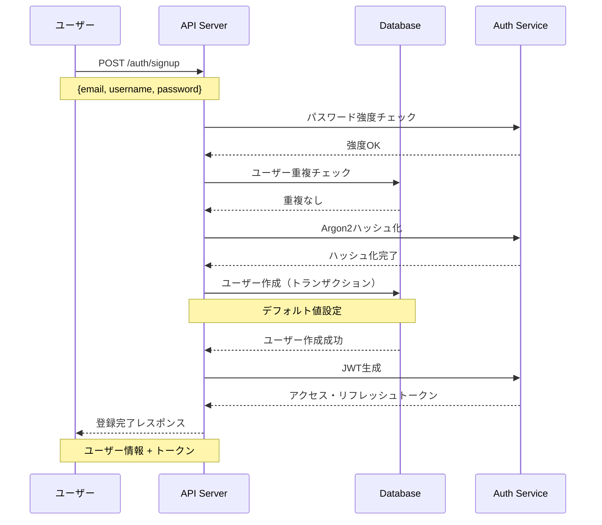

### 1.2 登録直後のデフォルト設定

新規ユーザーには以下のデフォルト値が設定されます：

| 項目 | デフォルト値 | 説明 |
|------|-------------|------|
| `subscription_tier` | `"free"` | 無料プラン |
| `role` | `"member"` | 一般ユーザー権限 |
| `is_active` | `true` | 即座にログイン可能 |
| `email_verified` | `false` | メール認証は未完了 |
| `permission_scope` | `Own` | 自分のデータのみアクセス可能 |
| `task_quota` | `100` | 最大100タスク |
| `rate_limit` | `10/分` | 分間10リクエスト |

### 1.3 即座に利用可能な機能

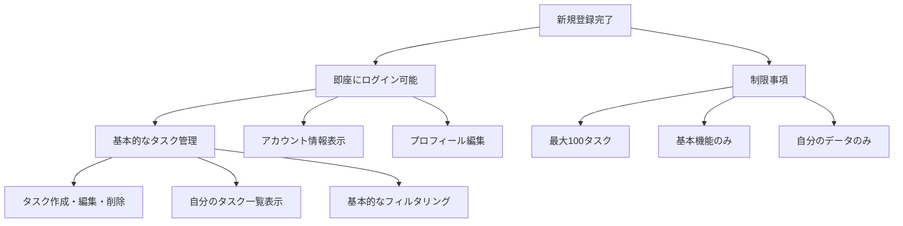

## シナリオ2: サブスクリプション階層による機能差分

### 2.1 Free Tier（無料プラン）

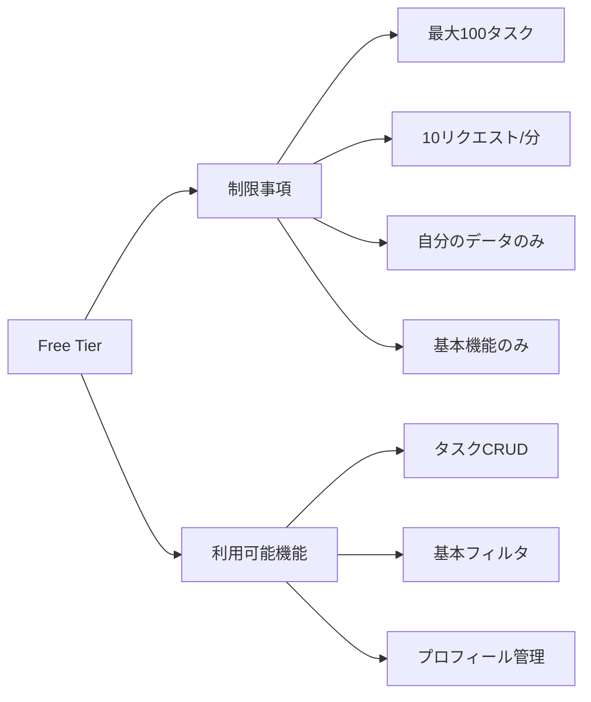

**利用可能なエンドポイント例：**
- `GET /tasks` - 最大100件の自分のタスク
- `POST /tasks` - タスク作成
- `GET /tasks/{id}` - 自分のタスク詳細
- `PUT /tasks/{id}` - 自分のタスク更新
- `DELETE /tasks/{id}` - 自分のタスク削除

### 2.2 Pro Tier（プロプラン）

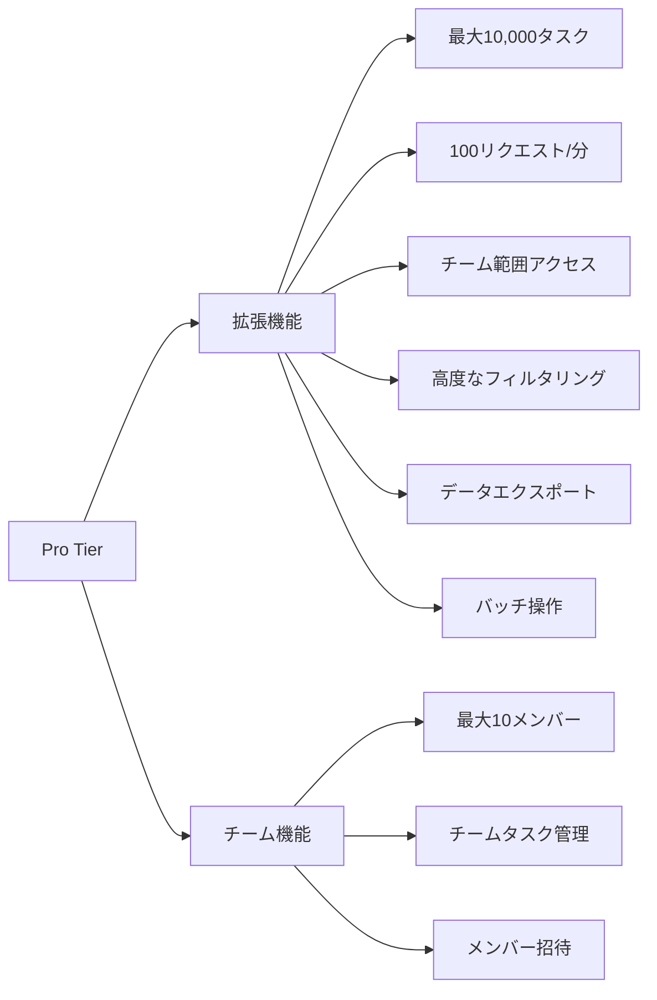

**Pro限定機能：**
- 高度な検索とフィルタリング
- CSV/JSONエクスポート
- チームタスクの閲覧・管理
- バッチ操作（最大1,000件）

### 2.3 Enterprise Tier（エンタープライズプラン）

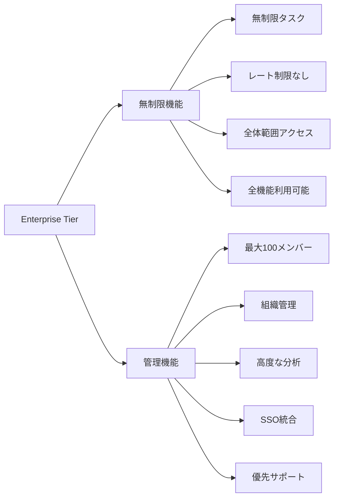

**Enterprise限定機能：**
- 無制限のタスクとリクエスト
- 組織全体の管理機能
- 高度な分析とレポート
- カスタムロールとパーミッション

## シナリオ3: 動的パーミッションシステム

### 3.1 同一エンドポイントの異なる挙動

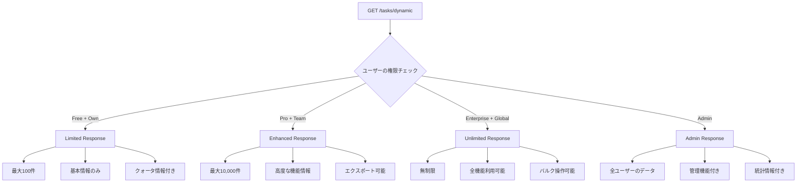

## シナリオ4: チーム・組織管理

### 4.1 チーム作成・参加フロー

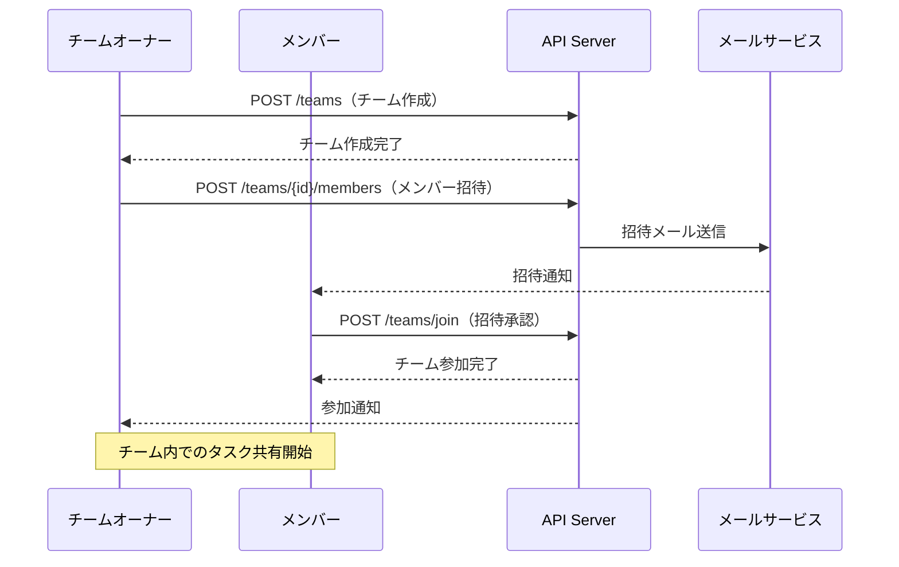

### 4.2 チーム内での権限管理

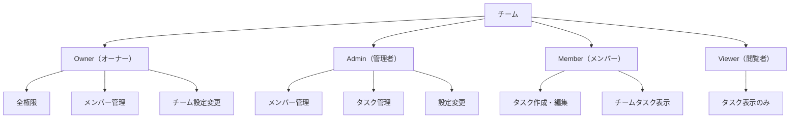

## シナリオ5: サブスクリプション変更フロー

### 5.1 アップグレードシナリオ

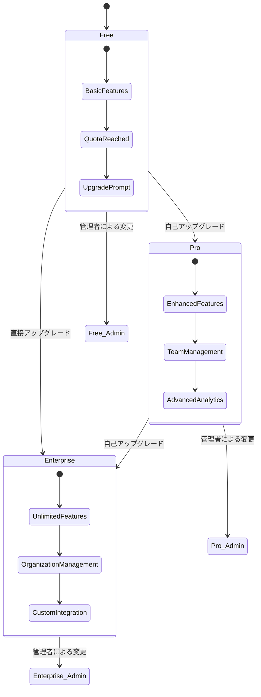

### 5.2 ダウングレード時の制限処理

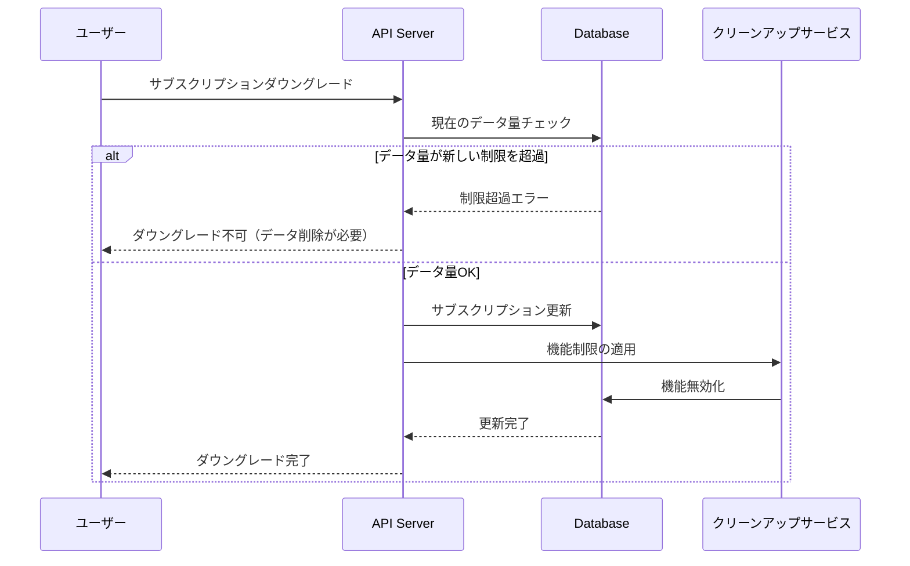

## シナリオ6: 認証・セキュリティフロー

### 6.1 トークン管理

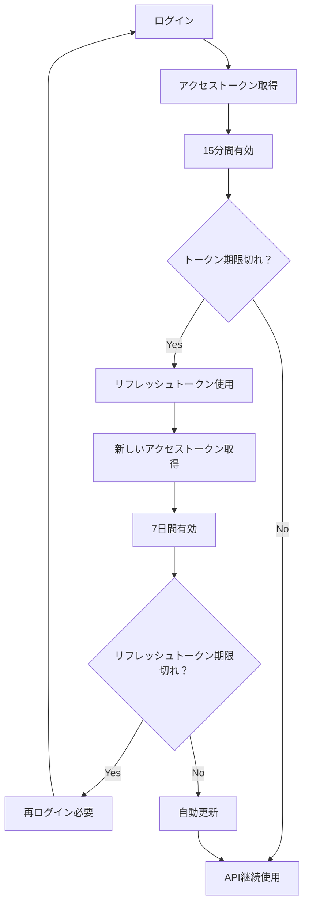

### 6.2 パスワードリセットフロー

```mermaid
sequenceDiagram
    participant User as ユーザー
    participant API as API Server
    participant Email as メールサービス
    participant DB as Database
    
    User->>API: POST /auth/forgot-password
    API->>DB: ユーザー存在確認
    DB-->>API: ユーザー確認
    
    API->>DB: リセットトークン生成・保存
    API->>Email: リセットメール送信
    Email-->>User: リセットリンク
    
    User->>API: POST /auth/reset-password
    Note over User,API: トークン + 新パスワード
    
    API->>DB: トークン検証
    DB-->>API: 有効なトークン
    
    API->>DB: パスワード更新
    API->>DB: リセットトークン無効化
    DB-->>API: 更新完了
    
    API-->>User: パスワード変更完了
```

## シナリオ7: エラーハンドリング

### 7.1 権限不足エラー

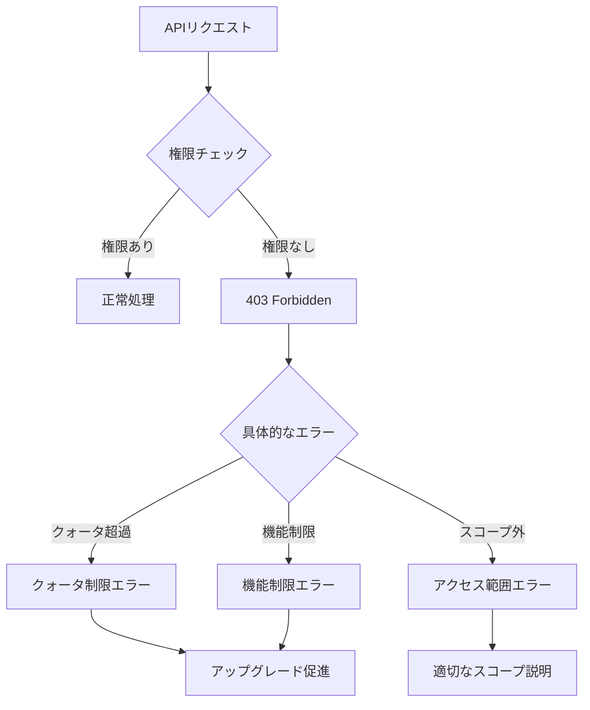

### 7.2 サブスクリプション制限エラー

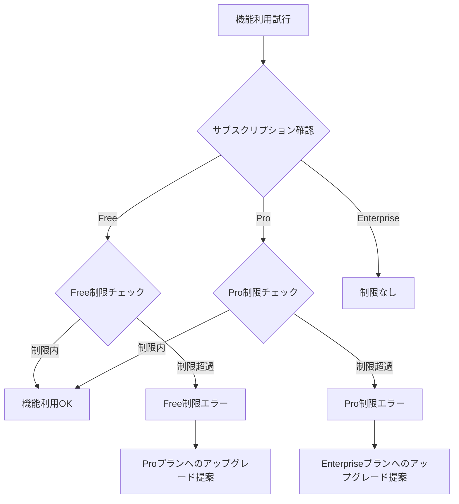

## シナリオ8: 管理者権限による特別フロー

### 8.1 管理者による強制変更

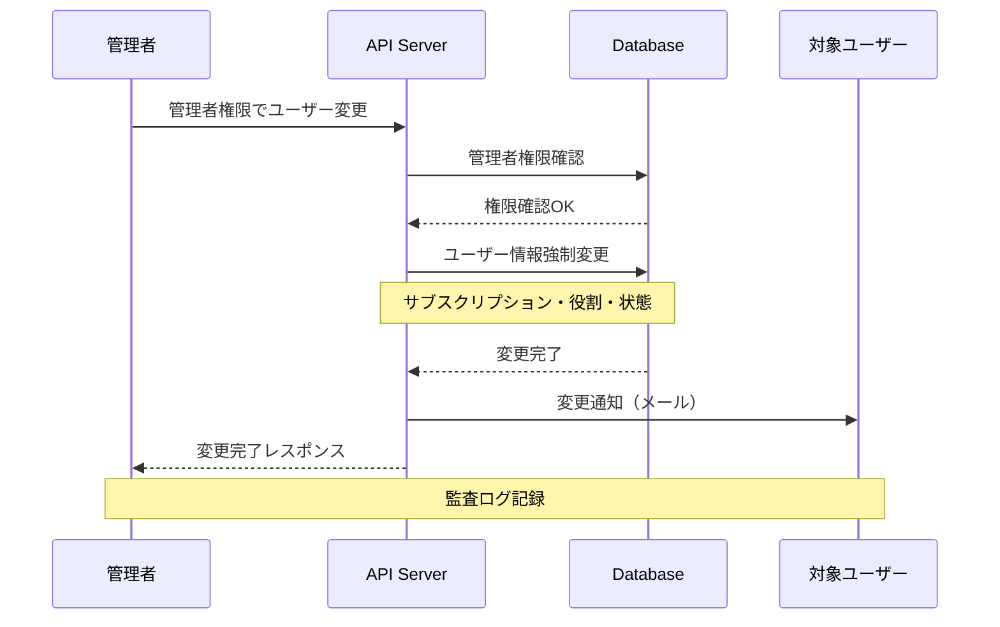

## まとめ

このシステムは、**ユーザーの成長に合わせて段階的に機能を開放する**設計となっています：

1. **新規登録時**：即座に基本機能が利用可能
2. **Free Tier**：個人利用に十分な基本機能
3. **Pro Tier**：チーム協働と高度な機能
4. **Enterprise Tier**：組織全体の管理と無制限利用

各段階で同一APIが異なる応答を返すことで、ユーザーは段階的な機能拡張を体験でき、開発者はエンドポイントの一貫性を保てます。

この動的パーミッションシステムにより、**スケーラブルで保守性の高いサブスクリプションベースSaaS**を実現しています。