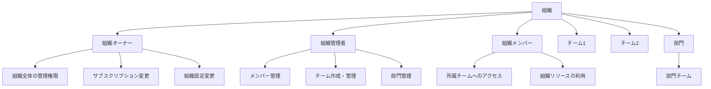
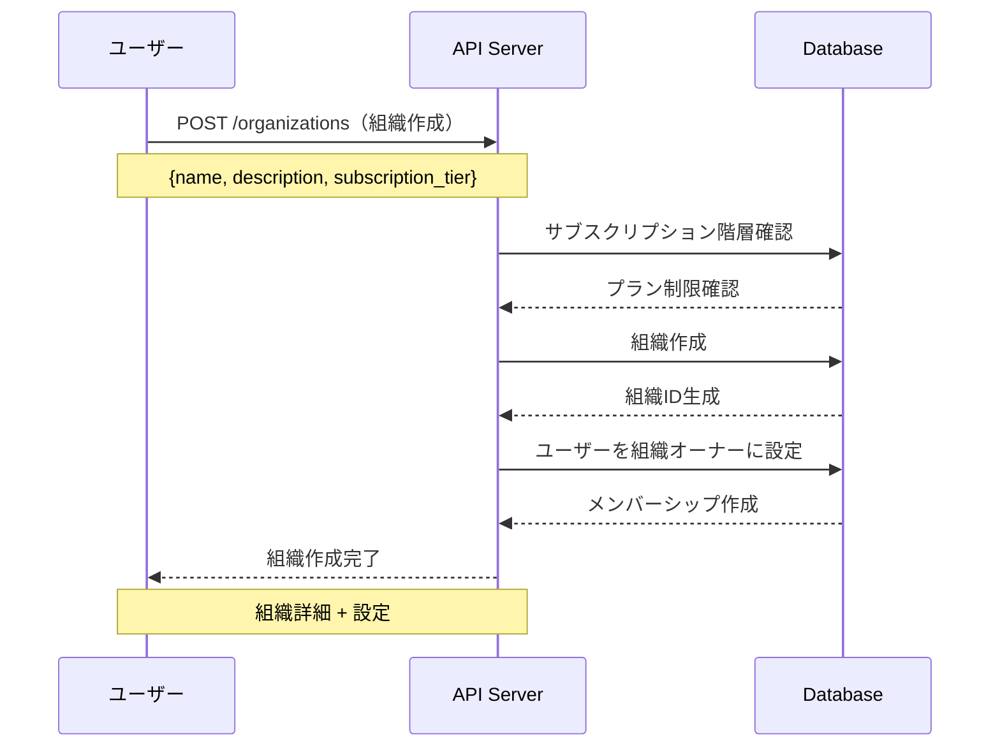
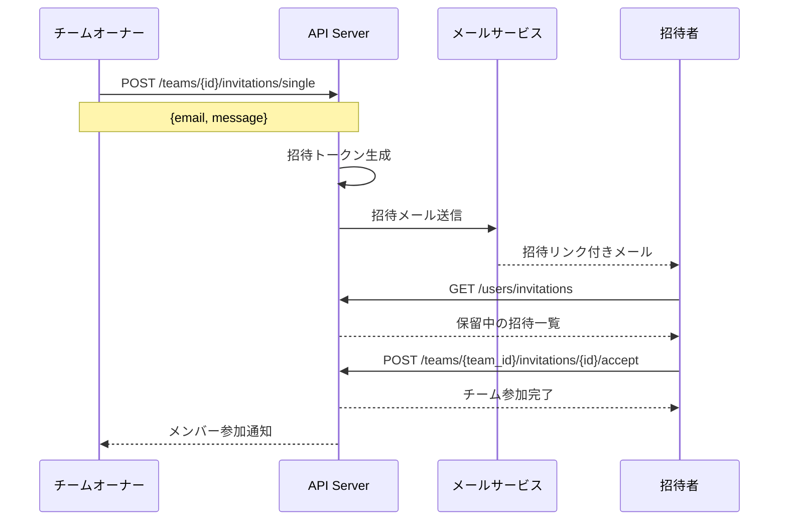
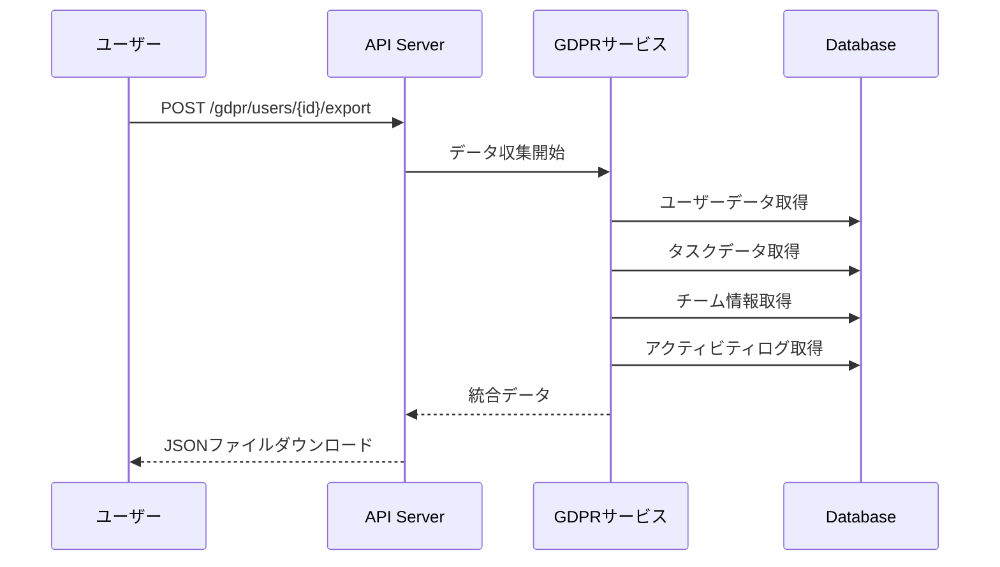
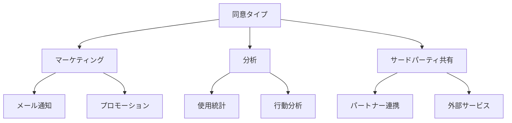
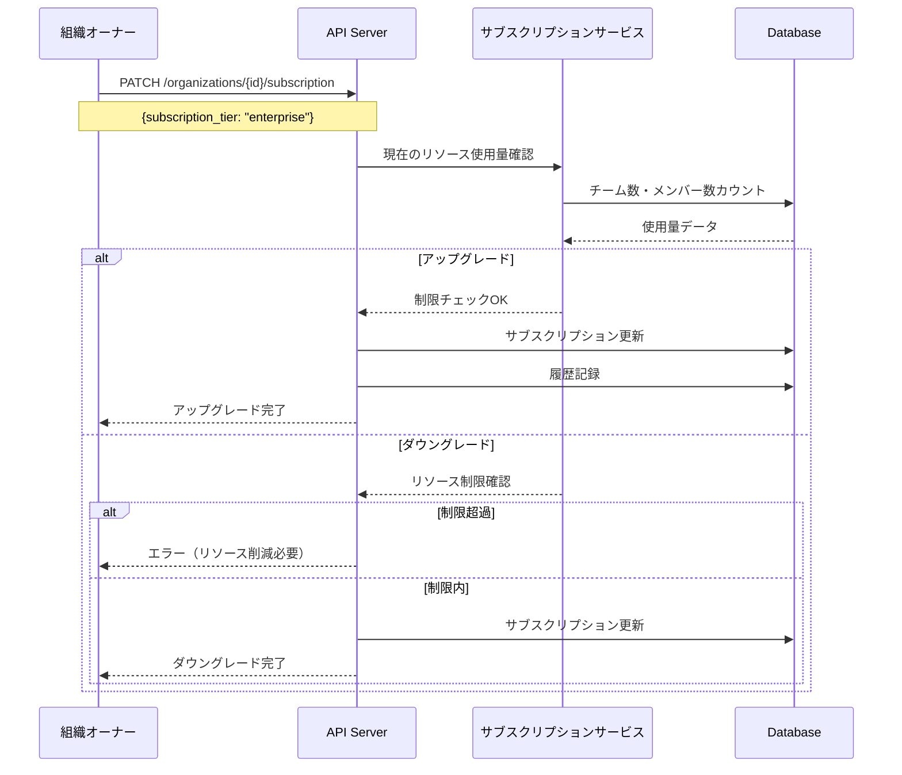
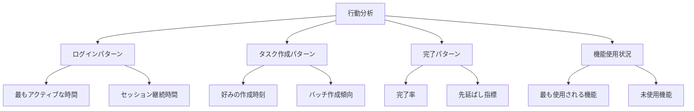
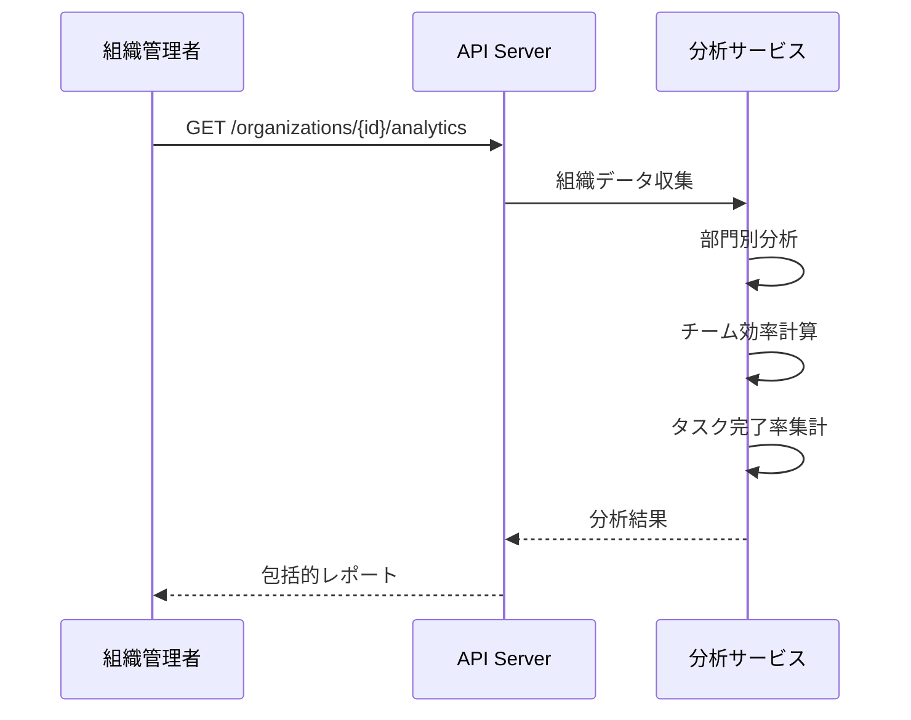
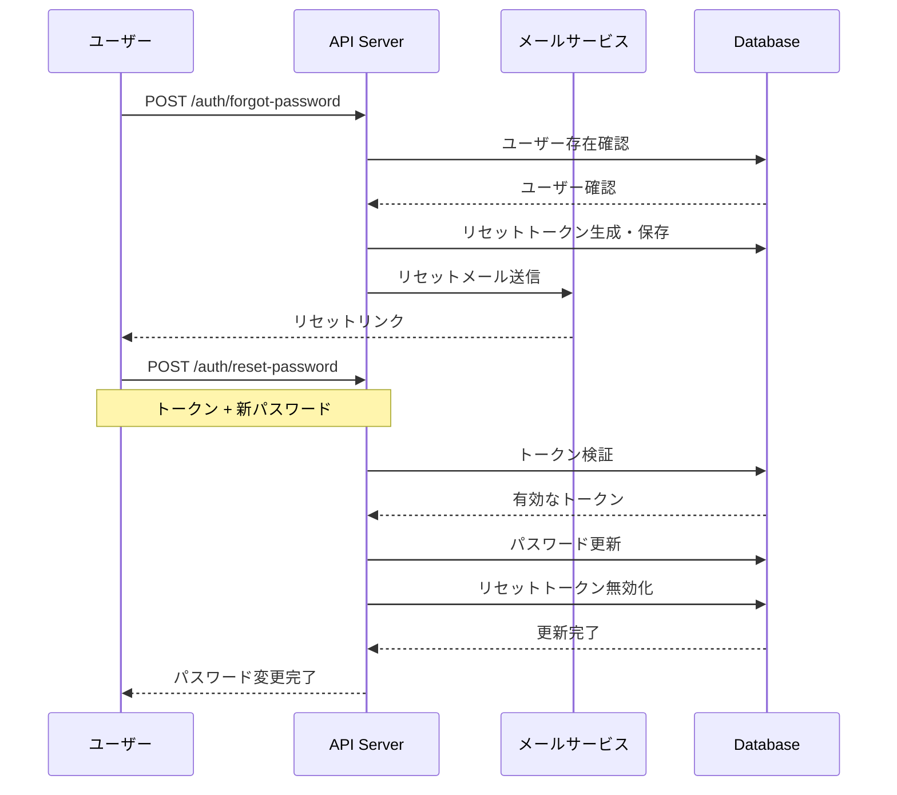

# ユーザー登録後のシナリオ完全ガイド

このドキュメントでは、ユーザーがアカウント作成後に体験する全てのシナリオを網羅的に説明します。

## 概要

このRust製タスク管理APIは、**動的パーミッションシステム**を採用しており、ユーザーの役割とサブスクリプション階層によって同一エンドポイントが異なる応答を返すことが特徴です。

## シナリオ1: 新規ユーザー登録直後

### 1.1 基本的な登録フロー


### 1.2 登録直後のデフォルト設定

新規ユーザーには以下のデフォルト値が設定されます：

| 項目 | デフォルト値 | 説明 |
|------|-------------|------|
| `subscription_tier` | `"free"` | 無料プラン |
| `role` | `"member"` | 一般ユーザー権限 |
| `is_active` | `true` | 即座にログイン可能 |
| `email_verified` | `false` | メール認証は未完了 |
| `permission_scope` | `Own` | 自分のデータのみアクセス可能 |
| `task_quota` | `100` | 最大100タスク |
| `rate_limit` | `10/分` | 分間10リクエスト |

### 1.3 即座に利用可能な機能


## シナリオ2: サブスクリプション階層による機能差分

### 2.1 Free Tier（無料プラン）


**利用可能なエンドポイント例：**
- `GET /tasks` - 最大100件の自分のタスク
- `POST /tasks` - タスク作成
- `GET /tasks/{id}` - 自分のタスク詳細
- `PUT /tasks/{id}` - 自分のタスク更新
- `DELETE /tasks/{id}` - 自分のタスク削除

### 2.2 Pro Tier（プロプラン）


**Pro限定機能：**
- 高度な検索とフィルタリング
- CSV/JSONエクスポート
- チームタスクの閲覧・管理
- バッチ操作（最大1,000件）

### 2.3 Enterprise Tier（エンタープライズプラン）


**Enterprise限定機能：**
- 無制限のタスクとリクエスト
- 組織全体の管理機能
- 高度な分析とレポート
- カスタムロールとパーミッション

## シナリオ3: 動的パーミッションシステム

### 3.1 同一エンドポイントの異なる挙動


## シナリオ4: チーム・組織管理

### 4.0 組織階層による管理

組織は複数のチームを統括し、階層的な権限管理を実現します。



### 4.1 組織作成フロー



### 4.2 チーム作成・参加フロー


### 4.3 チーム招待システム

新しいチーム招待システムにより、メールベースの招待管理が可能です。



### 4.4 チーム内での権限管理


## シナリオ5: GDPR準拠のデータ管理

### 5.1 ユーザーデータエクスポート



### 5.2 ユーザー同意管理



## シナリオ6: サブスクリプション変更フロー

### 6.1 組織サブスクリプション管理

組織単位でのサブスクリプション管理が可能になりました。



### 6.2 アップグレードシナリオ


### 6.3 ダウングレード時の制限処理


## シナリオ7: 高度な分析・メトリクス

### 7.1 ユーザー行動分析（Pro以上）



### 7.2 組織分析（Enterprise）



## シナリオ8: 認証・セキュリティフロー

### 8.1 トークン管理


### 8.2 パスワードリセットフロー



### 8.3 セキュリティ監査（管理者）

```mermaid
graph TD
    A[セキュリティ監査] --> B[トークン統計]
    A --> C[疑わしいアクティビティ]
    A --> D[ログイン失敗分析]
    A --> E[地理的分析]
    
    B --> B1[アクティブトークン数]
    B --> B2[期限切れトークン]
    
    C --> C1[複数デバイスログイン]
    C --> C2[異常なリクエストパターン]
    
    D --> D1[ブルートフォース検出]
    D --> D2[アカウントロック推奨]
    
    E --> E1[国別アクセス]
    E --> E2[疑わしい地域からのアクセス]
```

## シナリオ9: エラーハンドリング

### 9.1 権限不足エラー

```mermaid
graph TD
    A[APIリクエスト] --> B{権限チェック}
    
    B -->|権限あり| C[正常処理]
    B -->|権限なし| D[403 Forbidden]
    
    D --> E{具体的なエラー}
    E -->|クォータ超過| F[クォータ制限エラー]
    E -->|機能制限| G[機能制限エラー]
    E -->|スコープ外| H[アクセス範囲エラー]
    
    F --> I[アップグレード促進]
    G --> I
    H --> J[適切なスコープ説明]
```

### 9.2 サブスクリプション制限エラー

```mermaid
graph TD
    A[機能利用試行] --> B{サブスクリプション確認}
    
    B -->|Free| C{Free制限チェック}
    B -->|Pro| D{Pro制限チェック}
    B -->|Enterprise| E[制限なし]
    
    C -->|制限内| F[機能利用OK]
    C -->|制限超過| G[Free制限エラー]
    
    D -->|制限内| F
    D -->|制限超過| H[Pro制限エラー]
    
    G --> I[Proプランへのアップグレード提案]
    H --> J[Enterpriseプランへのアップグレード提案]
```

## シナリオ10: 管理者権限による特別フロー

### 10.1 管理者による強制変更

```mermaid
sequenceDiagram
    participant Admin as 管理者
    participant API as API Server
    participant DB as Database
    participant User as 対象ユーザー
    
    Admin->>API: 管理者権限でユーザー変更
    API->>DB: 管理者権限確認
    DB-->>API: 権限確認OK
    
    API->>DB: ユーザー情報強制変更
    Note over API,DB: サブスクリプション・役割・状態
    
    DB-->>API: 変更完了
    API->>User: 変更通知（メール）
    API-->>Admin: 変更完了レスポンス
    
    Note over Admin,User: 監査ログ記録
```

## シナリオ11: バルク操作と一括処理

### 11.1 管理者向けバルク操作

```mermaid
sequenceDiagram
    participant Admin as 管理者
    participant API as API Server
    participant Batch as バッチ処理
    participant DB as Database
    
    Admin->>API: POST /admin/users/bulk-operations
    Note over Admin,API: {operation: "export_activity", filters}
    
    API->>Batch: バッチジョブ作成
    Batch->>DB: フィルタ条件でユーザー抽出
    
    loop 各ユーザー
        Batch->>DB: データ収集
    end
    
    Batch-->>API: CSVファイル生成
    API-->>Admin: ダウンロードリンク
```

## まとめ

このシステムは、**ユーザーの成長に合わせて段階的に機能を開放する**設計となっています：

1. **新規登録時**：即座に基本機能が利用可能
2. **Free Tier**：個人利用に十分な基本機能
3. **Pro Tier**：チーム協働と高度な機能
4. **Enterprise Tier**：組織全体の管理と無制限利用

### 新機能の統合

最新のアップデートにより、以下の機能が追加されました：

- **GDPR準拠**：データエクスポート、削除権、同意管理
- **組織階層管理**：部門構造、権限継承、階層的管理
- **チーム招待システム**：メールベースの招待、一括招待、統計分析
- **高度な分析**：行動パターン分析、組織効率メトリクス
- **セキュリティ強化**：トークン監視、セッション分析、監査レポート
- **サブスクリプション管理**：組織単位の管理、ダウングレード制約、履歴追跡

各段階で同一APIが異なる応答を返すことで、ユーザーは段階的な機能拡張を体験でき、開発者はエンドポイントの一貫性を保てます。

この動的パーミッションシステムにより、**スケーラブルで保守性の高いサブスクリプションベースSaaS**を実現しています。