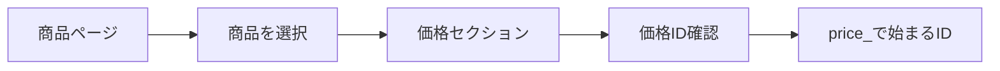

# Stripe初期設定ガイド

## 📋 目次

1. [Stripeアカウント作成](#stripeアカウント作成)
2. [商品・価格の登録](#商品価格の登録)
3. [カスタマーポータル設定](#カスタマーポータル設定)
4. [環境変数の設定](#環境変数の設定)

## 🚀 Stripeアカウント作成

### 1. アカウント登録

1. [https://stripe.com/jp](https://stripe.com/jp) にアクセス
2. 「今すぐ始める」をクリック
3. メールアドレスを入力してアカウント作成
4. メール認証を完了

### 2. テストモードの確認

```
⚠️ 重要: 開発中は必ず「テストモード」を使用
```

- ダッシュボード左上の「テストモード」スイッチがONになっていることを確認
- テストモードでは実際の決済は発生しません

## 💳 商品・価格の登録

### 1. 商品の作成

1. Stripeダッシュボードで「商品」→「商品を追加」をクリック
2. 以下の商品を作成：

#### Pro プラン
```
商品名: Task Backend Pro
説明: プロフェッショナル向けタスク管理
```

#### Enterprise プラン
```
商品名: Task Backend Enterprise  
説明: 企業向け無制限タスク管理
```

### 2. 価格の設定

各商品に対して価格を設定します：

#### Pro プラン価格
```
価格: ¥5,000
請求期間: 月次
価格ID: price_XXXXXX（自動生成される）
```

#### Enterprise プラン価格
```
価格: ¥20,000
請求期間: 月次
価格ID: price_XXXXXX（自動生成される）
```

### 3. 価格IDの確認方法



⚠️ **重要**: 価格IDは `price_` で始まります。商品IDの `prod_` ではありません！

## 🎯 カスタマーポータル設定

### 1. カスタマーポータルへアクセス

1. Stripeダッシュボードで「設定」→「Billing」→「カスタマーポータル」
2. または直接: [https://dashboard.stripe.com/test/settings/billing/portal](https://dashboard.stripe.com/test/settings/billing/portal)

### 2. 必須設定項目

#### 基本設定
- ✅ カスタマーポータルを有効化
- ✅ ホームページURL: `http://localhost:3000`（開発環境）

#### 機能設定
- ✅ 請求書履歴を表示
- ✅ 顧客情報を更新
- ✅ 決済手段を更新
- ✅ サブスクリプションをキャンセル

### 3. 設定の保存

「変更を保存」をクリックして設定を完了

## 🔧 環境変数の設定

### 1. 必要な環境変数

`.env`ファイルに以下を設定：

```bash
# 決済モード設定
PAYMENT_DEVELOPMENT_MODE=false  # Stripeテストモードを使用

# Stripe APIキー（テストモード）
STRIPE_SECRET_KEY=sk_test_XXXXXX        # ダッシュボードの「開発者」→「APIキー」から取得
STRIPE_PUBLISHABLE_KEY=pk_test_XXXXXX   # 公開可能キー

# 価格ID（商品登録時に生成されたもの）
STRIPE_PRO_PRICE_ID=price_XXXXXX        # Pro プランの価格ID
STRIPE_ENTERPRISE_PRICE_ID=price_XXXXXX # Enterprise プランの価格ID

# Webhook設定（後で設定）
STRIPE_WEBHOOK_SECRET=                   # 最初は空でOK
```

### 2. APIキーの取得方法

1. Stripeダッシュボードで「開発者」→「APIキー」
2. テストモードのキーをコピー：
   - **シークレットキー**: `sk_test_` で始まる
   - **公開可能キー**: `pk_test_` で始まる

### 3. 環境変数の検証

アプリケーション起動時に以下を確認：

```rust
// src/config/stripe.rs で自動検証
- 価格IDが "price_" で始まることを確認
- 開発モードでない場合、全ての必須変数が設定されていることを確認
```

## ✅ 設定完了チェックリスト

- [ ] Stripeアカウント作成完了
- [ ] テストモードがON
- [ ] Pro商品・価格作成（価格ID: `price_`で始まる）
- [ ] Enterprise商品・価格作成（価格ID: `price_`で始まる）
- [ ] カスタマーポータル設定完了
- [ ] .envファイルに全ての環境変数設定
- [ ] アプリケーションが正常に起動

## 🎉 次のステップ

設定が完了したら、[02_DEVELOPMENT.md](./02_DEVELOPMENT.md) で開発環境での動作確認を行いましょう。