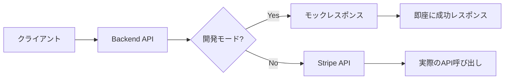
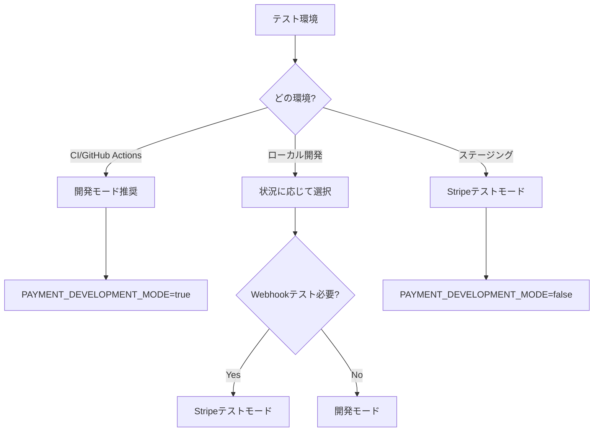

# 開発・テスト環境ガイド

## 📋 目次

1. [開発モード（モック決済）](#開発モードモック決済)
2. [Stripeテストモード](#stripeテストモード)
3. [テスト戦略](#テスト戦略)
4. [動作確認手順](#動作確認手順)

## 🔧 開発モード（モック決済）

### 概要

開発モードは、Stripe APIを使用せずにモックレスポンスを返すモードです。



### 設定方法

```bash
# .env
PAYMENT_DEVELOPMENT_MODE=true  # 開発モードを有効化
# Stripe関連の環境変数は不要
```

### 利点

- ✅ Stripeアカウント不要
- ✅ インターネット接続不要
- ✅ 高速なテスト実行
- ✅ CI環境に最適

### 制限事項

- ❌ 実際のStripe APIの動作確認不可
- ❌ Webhookのテスト不可
- ❌ エラーケースの確認が限定的

## 💳 Stripeテストモード

### 概要

Stripeの実際のテスト環境を使用して、本番に近い動作確認を行います。

### 設定方法

```bash
# .env
PAYMENT_DEVELOPMENT_MODE=false  # Stripeテストモードを使用

# Stripe APIキー（テストモード）
STRIPE_SECRET_KEY=sk_test_XXXXXX
STRIPE_PUBLISHABLE_KEY=pk_test_XXXXXX

# 価格ID
STRIPE_PRO_PRICE_ID=price_XXXXXX
STRIPE_ENTERPRISE_PRICE_ID=price_XXXXXX

# Webhook（ローカルテスト時は後で設定）
STRIPE_WEBHOOK_SECRET=
```

### テストカード番号

| カード番号 | 説明 | 結果 |
|-----------|------|------|
| 4242 4242 4242 4242 | 成功 | 決済成功 |
| 4000 0000 0000 9995 | 拒否 | カード拒否エラー |
| 4000 0000 0000 0002 | 拒否 | 一般的な拒否 |

その他の項目：
- **有効期限**: 将来の任意の日付（例: 12/34）
- **CVC**: 任意の3桁（例: 123）
- **郵便番号**: 任意の5桁（例: 12345）

## 🎯 テスト戦略

### 環境別推奨設定



### CI環境（`.env.test`）

```bash
# CI用の設定
PAYMENT_DEVELOPMENT_MODE=true
# Stripeキーは不要
```

### ローカル開発

#### 基本的な開発時
```bash
# 高速な開発サイクル用
PAYMENT_DEVELOPMENT_MODE=true
```

#### Stripe統合テスト時
```bash
# 実際のStripe APIをテスト
PAYMENT_DEVELOPMENT_MODE=false
STRIPE_SECRET_KEY=sk_test_XXXXXX
# ... その他の設定
```

## 🚀 動作確認手順

### 1. サーバー起動

```bash
# データベース起動（Dockerを使用）
docker-compose up postgres -d

# マイグレーション実行
make migrate

# サーバー起動
make run
```

### 2. テストスクリプト実行

```bash
# scriptsディレクトリに移動
cd scripts

# テストスクリプト実行
./stripe_test_simple.sh
```

### 3. 確認ポイント

#### 開発モード
```json
{
  "checkout_url": "http://localhost:5000/mock-checkout/cs_mock_XXXXX"
}
```

#### Stripeテストモード
```json
{
  "checkout_url": "https://checkout.stripe.com/c/pay/cs_test_XXXXX"
}
```

### 4. ブラウザでの確認

1. 生成されたチェックアウトURLをブラウザで開く
2. テストカード情報を入力
3. 決済完了を確認

## 🧪 統合テスト

### テスト実行コマンド

```bash
# 全テスト実行
make test

# 決済関連テストのみ
make test-integration GROUP=integration::payment

# 開発モードでテスト
PAYMENT_DEVELOPMENT_MODE=true make test
```

### テストカバレッジ

現在のテストでカバーされている機能：

- ✅ チェックアウトセッション作成
- ✅ カスタマーポータルセッション作成
- ✅ 現在のサブスクリプション確認
- ✅ 利用可能プラン一覧
- ✅ Webhookイベント処理（モック）
- ✅ エラーハンドリング

## 📊 ログ確認

### 開発時のログ確認

```bash
# サーバーログ
tail -f server.log

# Stripe関連のログのみ
tail -f server.log | grep -i stripe

# Webhookログ
tail -f server.log | grep -i webhook
```

### デバッグ時の環境変数

```bash
# 詳細ログを有効化
RUST_LOG=debug cargo run --package task-backend
```

## ⚠️ トラブルシューティング

### よくある問題

1. **価格IDエラー**
   ```
   No such price: 'prod_XXXXX'
   ```
   → 商品ID（`prod_`）ではなく価格ID（`price_`）を使用

2. **Webhook署名エラー**
   ```
   Invalid webhook signature
   ```
   → 開発環境では`STRIPE_WEBHOOK_SECRET`を空にするか、Stripe CLIを使用

3. **カスタマーポータルエラー**
   ```
   No configuration provided
   ```
   → Stripeダッシュボードでカスタマーポータルを設定

## 🎉 次のステップ

- Webhookのローカルテスト → [03_WEBHOOK.md](./03_WEBHOOK.md)
- 実装の詳細を理解 → [04_IMPLEMENTATION.md](./04_IMPLEMENTATION.md)