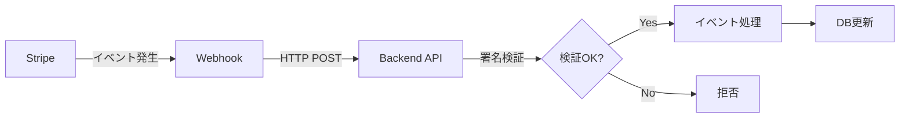
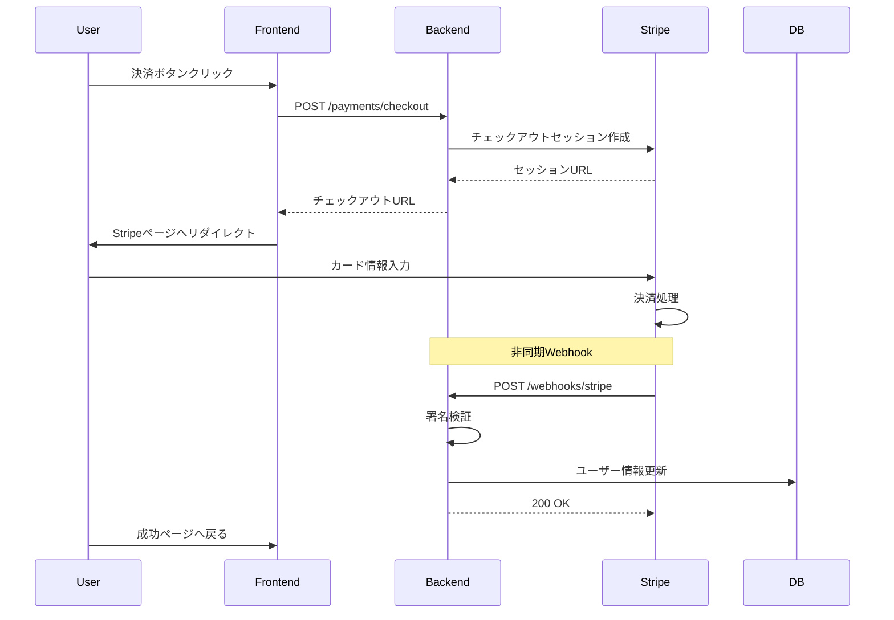
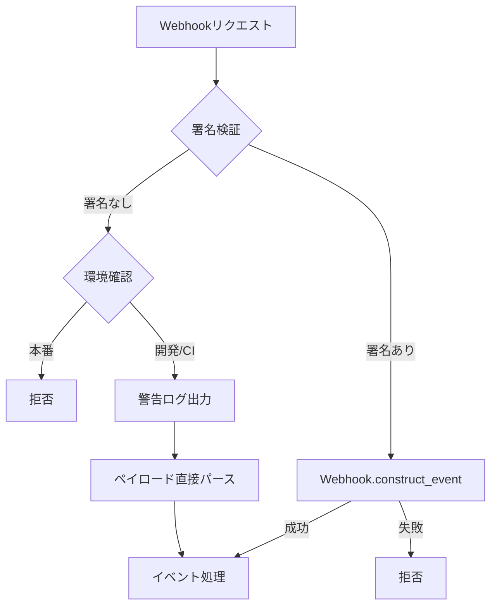

# Stripe Webhook設定・テストガイド

## 📋 目次

1. [Webhookの役割](#webhookの役割)
2. [ローカル環境でのテスト](#ローカル環境でのテスト)
3. [Webhookイベントフロー](#webhookイベントフロー)
4. [セキュリティ設定](#セキュリティ設定)

## 🎯 Webhookの役割

### 概要

WebhookはStripe側で発生したイベントをバックエンドアプリケーションに通知する仕組みです。



### 主要なイベント

| イベント | 説明 | アプリケーション側の処理 |
|---------|------|-------------------------|
| `checkout.session.completed` | 決済完了 | ユーザーのサブスクリプション更新 |
| `customer.subscription.deleted` | サブスクリプション削除 | ユーザーをFreeプランに戻す |
| `invoice.payment_failed` | 支払い失敗 | ユーザーに通知、再試行促す |

## 🔧 ローカル環境でのテスト

### 1. Stripe CLIのインストール

```bash
# Linuxの場合
curl -s https://packages.stripe.dev/api/security/keypair/stripe-cli-gpg/public | gpg --dearmor | sudo tee /usr/share/keyrings/stripe.gpg
echo "deb [signed-by=/usr/share/keyrings/stripe.gpg] https://packages.stripe.dev/stripe-cli-debian-local stable main" | sudo tee -a /etc/apt/sources.list.d/stripe.list
sudo apt update
sudo apt install stripe

# インストール確認
stripe --version
```

### 2. Stripe CLIでログイン

```bash
# Stripeアカウントにログイン
stripe login

# ブラウザが開いて認証を求められます
# 認証コードを確認してターミナルに入力
```

### 3. Webhookフォワーディング設定

```bash
# ローカルサーバーにWebhookを転送
stripe listen --forward-to localhost:5000/webhooks/stripe

# 出力例：
# Ready! Your webhook signing secret is whsec_XXXXXX (^C to quit)
```

### 4. 環境変数の更新

表示された署名シークレットを`.env`に設定：

```bash
STRIPE_WEBHOOK_SECRET=whsec_XXXXXX  # CLIが表示した値
```

### 5. テストイベントの送信

別のターミナルで：

```bash
# チェックアウト完了イベントをトリガー
stripe trigger checkout.session.completed

# サブスクリプション削除イベントをトリガー
stripe trigger customer.subscription.deleted

# 支払い失敗イベントをトリガー
stripe trigger invoice.payment_failed
```

## 📊 Webhookイベントフロー

### checkout.session.completed



### 実装コード（簡略版）

```rust
// src/service/payment_service.rs
pub async fn handle_webhook(&self, payload: &str, stripe_signature: &str) -> AppResult<()> {
    // 開発モードチェック
    if self.stripe_config.development_mode {
        return Ok(());
    }

    // 署名検証
    let event = if self.stripe_config.webhook_secret.is_empty() {
        // CI環境用：署名検証スキップ
        serde_json::from_str::<Event>(payload)?
    } else {
        // 本番/テスト環境：署名検証
        Webhook::construct_event(payload, stripe_signature, &self.stripe_config.webhook_secret)?
    };

    // イベント処理
    match event.type_ {
        EventType::CheckoutSessionCompleted => {
            self.handle_checkout_completed(session).await?;
        }
        EventType::CustomerSubscriptionDeleted => {
            self.handle_subscription_deleted(subscription).await?;
        }
        EventType::InvoicePaymentFailed => {
            self.handle_payment_failed(invoice).await?;
        }
        _ => {
            tracing::info!("Unhandled event type: {:?}", event.type_);
        }
    }

    Ok(())
}
```

## 🔒 セキュリティ設定

### 署名検証の重要性



### 環境別設定

| 環境 | PAYMENT_DEVELOPMENT_MODE | STRIPE_WEBHOOK_SECRET | 動作 |
|-----|-------------------------|----------------------|------|
| CI | true | 不要 | Webhookスキップ |
| ローカル（モック） | true | 不要 | Webhookスキップ |
| ローカル（Stripe） | false | 空 or 設定 | 署名検証 or 警告 |
| 本番 | false | 必須 | 署名検証必須 |

### ベストプラクティス

1. **本番環境では必ず署名検証**
   ```bash
   # 本番環境の.env
   PAYMENT_DEVELOPMENT_MODE=false
   STRIPE_WEBHOOK_SECRET=whsec_XXXXX  # 必須
   ```

2. **イベントの重複処理対策**
   - イベントIDをデータベースに保存
   - 同じイベントIDは処理をスキップ

3. **タイムアウト設定**
   - Stripeは20秒でタイムアウト
   - 重い処理は非同期化を検討

4. **エラーハンドリング**
   - 一時的なエラーは500を返してリトライ
   - 永続的なエラーは200を返して通知

## 📝 デバッグ方法

### ログ確認

```bash
# Webhookログの確認
tail -f server.log | grep -i webhook

# 特定のイベントタイプのみ
tail -f server.log | grep "checkout.session.completed"
```

### Stripe CLIでのイベント確認

```bash
# 受信したイベントをリアルタイムで表示
stripe listen --print-json --forward-to localhost:5000/webhooks/stripe
```

### よくあるエラー

1. **署名検証エラー**
   ```
   Invalid webhook signature
   ```
   → `STRIPE_WEBHOOK_SECRET`が正しく設定されているか確認

2. **404 Not Found**
   ```
   POST /webhooks/stripe 404
   ```
   → エンドポイントのパスを確認（`/webhooks/stripe`）

3. **タイムアウト**
   ```
   Timed out waiting for response
   ```
   → 処理時間が20秒を超えている可能性

## ⚠️ 既知の問題

### billing_portal.session.created イベントの400エラー

**症状**: `stripe listen`使用時に以下のようなエラーが表示される
```
2025-07-05 22:04:10  <--  [400] POST http://localhost:5000/webhooks/stripe [evt_XXX]
```

**原因**: 
- `async-stripe` v0.39が`billing_portal.session.created`イベントをサポートしていない
- パースエラーが発生し、400 Bad Requestを返す

**影響**:
- ❌ アプリケーションの動作には影響なし
- ❌ 本番環境でも同様に発生する
- ✅ 重要なイベント（決済完了、サブスクリプション更新）は正常に処理される

**対処法**:
1. **無視して問題ない** - このイベントは情報提供のみで、処理不要
2. **ログレベル調整** - エラーログが気になる場合
   ```bash
   RUST_LOG=task_backend=info,stripe=warn
   ```

**関連イベント**:
- `billing_portal.session.created` - カスタマーポータルセッション作成通知（処理不要）
- 実際のサブスクリプション変更は`customer.subscription.updated`で通知される

## 🎉 次のステップ

- 実装の詳細を理解 → [04_IMPLEMENTATION.md](./04_IMPLEMENTATION.md)
- 本番環境への移行 → [05_PRODUCTION.md](./05_PRODUCTION.md)