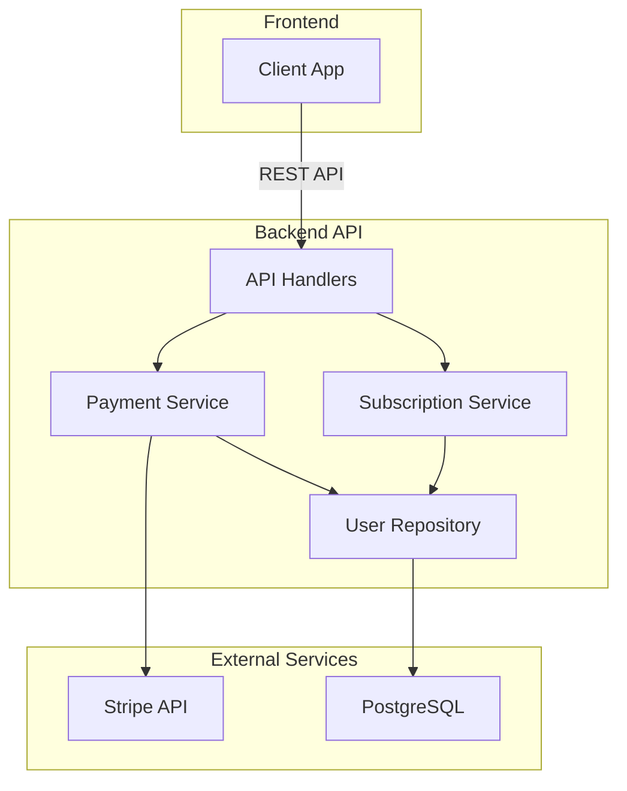
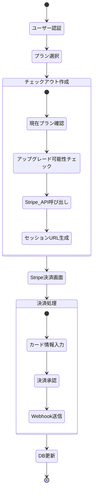
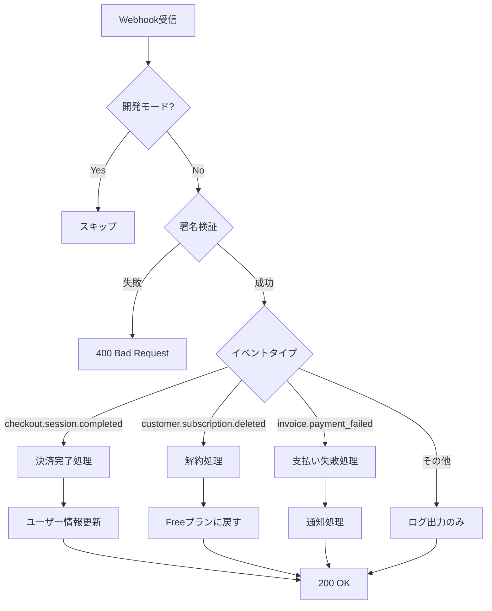
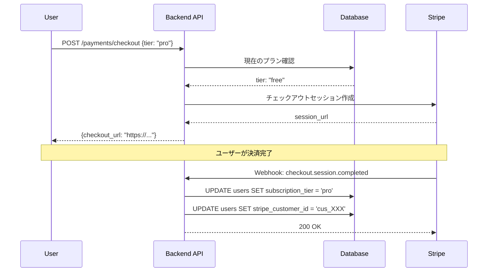
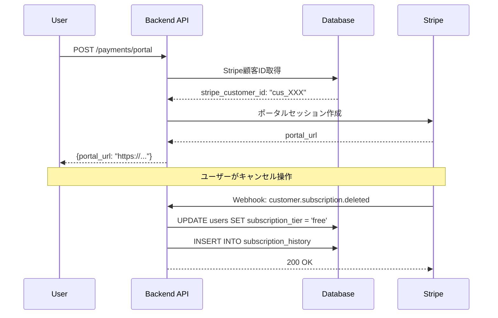

# Stripe統合実装詳細

## 📋 目次

1. [アーキテクチャ概要](#アーキテクチャ概要)
2. [決済フロー詳細](#決済フロー詳細)
3. [実装シナリオ](#実装シナリオ)
4. [エラーハンドリング](#エラーハンドリング)

## 🏗️ アーキテクチャ概要

### レイヤー構成



### 主要コンポーネント

| コンポーネント | ファイル | 責務 |
|--------------|---------|------|
| Payment Handler | `api/handlers/payment_handler.rs` | HTTPリクエスト処理 |
| Payment Service | `service/payment_service.rs` | Stripe API連携 |
| Subscription Service | `service/subscription_service.rs` | サブスクリプション管理 |
| Stripe Config | `config/stripe.rs` | 設定管理 |
| User Repository | `repository/user_repository.rs` | DB操作 |

## 📊 決済フロー詳細

### 1. チェックアウトフロー



### 2. 実装コード構造

#### API Handler層
```rust
// src/api/handlers/payment_handler.rs
pub async fn create_checkout_session(
    State(app_state): State<AppState>,
    user: AuthenticatedUser,
    Json(req): Json<CreateCheckoutRequest>,
) -> AppResult<Json<CreateCheckoutResponse>> {
    // 1. リクエストバリデーション
    req.validate()?;
    
    // 2. サービス層呼び出し
    let checkout_url = app_state
        .payment_service
        .create_checkout_session(user.id, &req.tier)
        .await?;
    
    // 3. レスポンス返却
    Ok(Json(CreateCheckoutResponse { checkout_url }))
}
```

#### Service層
```rust
// src/service/payment_service.rs
pub async fn create_checkout_session(
    &self,
    user_id: Uuid,
    tier: &str,
) -> AppResult<String> {
    // 1. 開発モードチェック
    if self.stripe_config.development_mode {
        return Ok(format!("http://localhost:5000/mock-checkout/{}", 
            generate_mock_session_id()));
    }
    
    // 2. 価格ID取得
    let price_id = self.stripe_config
        .get_price_id(tier)
        .ok_or_else(|| AppError::BadRequest("Invalid tier"))?;
    
    // 3. Stripeセッション作成
    let params = CreateCheckoutSession {
        mode: Some(CheckoutSessionMode::Subscription),
        line_items: Some(vec![
            CreateCheckoutSessionLineItems {
                price: Some(price_id.to_string()),
                quantity: Some(1),
                ..Default::default()
            }
        ]),
        success_url: Some(&self.success_url),
        cancel_url: Some(&self.cancel_url),
        metadata: Some(HashMap::from([
            ("user_id", user_id.to_string()),
            ("tier", tier.to_string()),
        ])),
        ..Default::default()
    };
    
    let session = CheckoutSession::create(&STRIPE_CLIENT, params).await?;
    
    // 4. URLを返却
    session.url.ok_or_else(|| 
        AppError::InternalServerError("No checkout URL"))
}
```

### 3. Webhook処理フロー



## 🎯 実装シナリオ

### シナリオ1: 新規ユーザーのアップグレード



### シナリオ2: サブスクリプションのキャンセル



### シナリオ3: 支払い失敗時の処理

```rust
// src/service/payment_service.rs
async fn handle_payment_failed(&self, invoice: Invoice) -> AppResult<()> {
    if let Some(customer_id) = invoice.customer {
        // 1. ユーザー検索
        let user = self.user_repo
            .find_by_stripe_customer_id(&customer_id.id())
            .await?;
        
        if let Some(user) = user {
            // 2. 通知（将来的に実装）
            tracing::warn!(
                user_id = %user.id,
                "Payment failed for user"
            );
            
            // 3. 必要に応じてサブスクリプション状態を更新
            // （Stripeの設定により自動的に処理される場合が多い）
        }
    }
    
    Ok(())
}
```

## ⚠️ エラーハンドリング

### エラー種別と対処

| エラー | 原因 | 対処法 |
|--------|------|--------|
| `No such price` | 価格IDが間違っている | 商品IDではなく価格IDを使用 |
| `Invalid webhook signature` | 署名不一致 | STRIPE_WEBHOOK_SECRETを確認 |
| `No Stripe customer ID` | 顧客未作成 | チェックアウト完了を待つ |
| `PoolTimedOut` | DB接続エラー | PostgreSQLの起動確認 |

### エラーレスポンス形式

```json
{
  "success": false,
  "error": "External service error",
  "message": "Stripe error: No such price: 'prod_XXX'",
  "error_type": "external_service_error"
}
```

### ベストプラクティス

1. **冪等性の確保**
   - 同じWebhookイベントを複数回処理しても安全
   - イベントIDをDBに保存して重複チェック

2. **タイムアウト対策**
   - 重い処理は非同期化
   - 20秒以内にレスポンスを返す

3. **エラーリカバリー**
   - 一時的エラーは500でリトライ
   - 永続的エラーは200で通知

4. **ログ記録**
   - 全てのStripe操作をログに記録
   - エラー時は詳細情報を含める

## 🔥 新機能: 決済履歴と機能ゲーティング

### 決済履歴の記録

#### データモデル
```rust
// src/domain/stripe_payment_history_model.rs
#[derive(DeriveEntityModel)]
#[sea_orm(table_name = "stripe_payment_history")]
pub struct Model {
    pub id: Uuid,
    pub user_id: Uuid,
    pub stripe_payment_intent_id: Option<String>,
    pub stripe_invoice_id: Option<String>,
    pub amount: i32,
    pub currency: String,
    pub status: String,  // succeeded, failed, pending, etc.
    pub description: Option<String>,
    pub paid_at: Option<DateTime<Utc>>,
    pub created_at: DateTime<Utc>,
}
```

#### 決済成功時の履歴記録
```rust
// src/service/payment_service.rs
async fn handle_checkout_completed(&self, session: CheckoutSession) -> AppResult<()> {
    // ... ユーザーID取得処理 ...
    
    // 支払い履歴を記録
    let payment_history = CreatePaymentHistory {
        user_id,
        stripe_payment_intent_id: session.payment_intent.as_ref().map(|pi| pi.id().to_string()),
        stripe_invoice_id: session.invoice.as_ref().map(|inv| inv.id().to_string()),
        amount: session.amount_total.unwrap_or(0) as i32,
        currency: session.currency.map(|c| c.to_string()).unwrap_or_else(|| "jpy".to_string()),
        status: PaymentStatus::Succeeded.as_str().to_string(),
        description: Some(format!("Subscription upgrade to {} tier", tier)),
        paid_at: Some(Utc::now()),
    };
    
    self.payment_history_repo
        .create(payment_history)
        .await?;
    
    // ... サブスクリプション更新処理 ...
}
```

#### 決済履歴APIエンドポイント
```rust
// src/api/handlers/payment_handler.rs
pub async fn get_payment_history_handler(
    State(app_state): State<AppState>,
    user: AuthenticatedUser,
    Query(query): Query<PaymentHistoryQuery>,
) -> AppResult<Json<ApiResponse<PaymentHistoryResponse>>> {
    let (history_items, total_pages) = app_state
        .payment_service
        .get_payment_history(user.claims.user_id, query.page - 1, query.per_page)
        .await?;
    
    // レスポンス構築...
}
```

### 機能ゲーティングミドルウェア

#### ミドルウェア実装
```rust
// src/middleware/subscription_guard.rs
pub async fn subscription_guard(
    State(config): State<SubscriptionGuardConfig>,
    Extension(auth_user): Extension<AuthenticatedUser>,
    request: Request,
    next: Next,
) -> Result<Response, AppError> {
    // ユーザー情報取得
    let user = config.user_repository
        .find_by_id(auth_user.user_id())
        .await?
        .ok_or_else(|| AppError::NotFound("User not found"))?;
    
    // 管理者は全機能アクセス可能
    if auth_user.is_admin() {
        return Ok(next.run(request).await);
    }
    
    // サブスクリプションレベルチェック
    let user_tier = SubscriptionTier::from_str(&user.subscription_tier);
    if !user_tier.has_access_to(&config.required_tier) {
        return Err(AppError::Forbidden(format!(
            "This feature requires {} subscription or higher",
            config.required_tier.as_str()
        )));
    }
    
    Ok(next.run(request).await)
}
```

#### 使用例: Pro限定機能
```rust
// src/api/handlers/some_handler.rs
pub fn premium_router(app_state: AppState) -> Router {
    Router::new()
        .route("/api/premium/analytics", get(premium_analytics_handler))
        .route("/api/premium/export", post(premium_export_handler))
        .layer(require_subscription_layer(
            app_state.user_repository.clone(),
            SubscriptionTier::Pro
        ))
        .with_state(app_state)
}
```

### 機能制限チェック

#### 数量ベースの制限
```rust
// src/middleware/subscription_guard.rs
pub fn check_feature_limit(
    user_tier: &SubscriptionTier,
    current_usage: usize,
    feature: &str,
) -> AppResult<()> {
    let limit = match (user_tier, feature) {
        (SubscriptionTier::Free, "teams") => 1,
        (SubscriptionTier::Pro, "teams") => 5,
        (SubscriptionTier::Enterprise, "teams") => usize::MAX,
        
        (SubscriptionTier::Free, "team_members") => 3,
        (SubscriptionTier::Pro, "team_members") => 10,
        (SubscriptionTier::Enterprise, "team_members") => usize::MAX,
        
        // 他の制限...
        _ => return Ok(()),
    };
    
    if current_usage >= limit {
        return Err(AppError::Forbidden(format!(
            "You have reached the {} limit for your {} plan",
            feature, user_tier.as_str()
        )));
    }
    
    Ok(())
}
```

#### チーム作成時の制限チェック例
```rust
// src/service/team_service.rs
pub async fn create_team(&self, user_id: Uuid, team_data: CreateTeamDto) -> AppResult<TeamDto> {
    // 現在のチーム数を取得
    let current_team_count = self.team_repo
        .count_teams_by_owner(user_id)
        .await?;
    
    // ユーザーのティアを取得
    let user = self.user_repo.find_by_id(user_id).await?
        .ok_or_else(|| AppError::NotFound("User not found"))?;
    let user_tier = SubscriptionTier::from_str(&user.subscription_tier);
    
    // 制限チェック
    check_feature_limit(&user_tier, current_team_count, "teams")?;
    
    // チーム作成処理...
}
```

### Stripeサブスクリプション情報管理

#### サブスクリプション詳細の保存
```rust
// src/domain/stripe_subscription_model.rs
#[derive(DeriveEntityModel)]
#[sea_orm(table_name = "stripe_subscriptions")]
pub struct Model {
    pub id: Uuid,
    pub user_id: Uuid,
    pub stripe_subscription_id: String,
    pub stripe_price_id: String,
    pub status: String,  // active, canceled, past_due, etc.
    pub current_period_start: Option<DateTime<Utc>>,
    pub current_period_end: Option<DateTime<Utc>>,
    pub cancel_at: Option<DateTime<Utc>>,
    pub canceled_at: Option<DateTime<Utc>>,
    pub created_at: DateTime<Utc>,
    pub updated_at: DateTime<Utc>,
}
```

### 統合テスト例

```rust
// tests/integration/payment/payment_history_tests.rs
#[tokio::test]
async fn test_feature_limits() {
    use task_backend::middleware::subscription_guard::check_feature_limit;
    
    // Free tier limits
    assert!(check_feature_limit(&SubscriptionTier::Free, 0, "teams").is_ok());
    assert!(check_feature_limit(&SubscriptionTier::Free, 1, "teams").is_err());
    
    // Pro tier limits
    assert!(check_feature_limit(&SubscriptionTier::Pro, 4, "teams").is_ok());
    assert!(check_feature_limit(&SubscriptionTier::Pro, 5, "teams").is_err());
    
    // Enterprise tier - no limits
    assert!(check_feature_limit(&SubscriptionTier::Enterprise, 10000, "teams").is_ok());
}
```

### ベストプラクティス

1. **決済履歴の完全性**
   - 全ての決済イベントを記録
   - 失敗した決済も記録して分析に活用
   - 重複記録を防ぐためInvoice IDで一意性チェック

2. **機能ゲーティングの柔軟性**
   - ミドルウェアレベルでの制御
   - サービス層での細かい制御
   - 管理者のバイパスロジック

3. **パフォーマンス考慮**
   - ユーザー情報のキャッシュ
   - 制限チェックの効率化
   - 非同期処理の活用

## 🎉 次のステップ

本番環境への移行準備 → [05_PRODUCTION.md](./05_PRODUCTION.md)